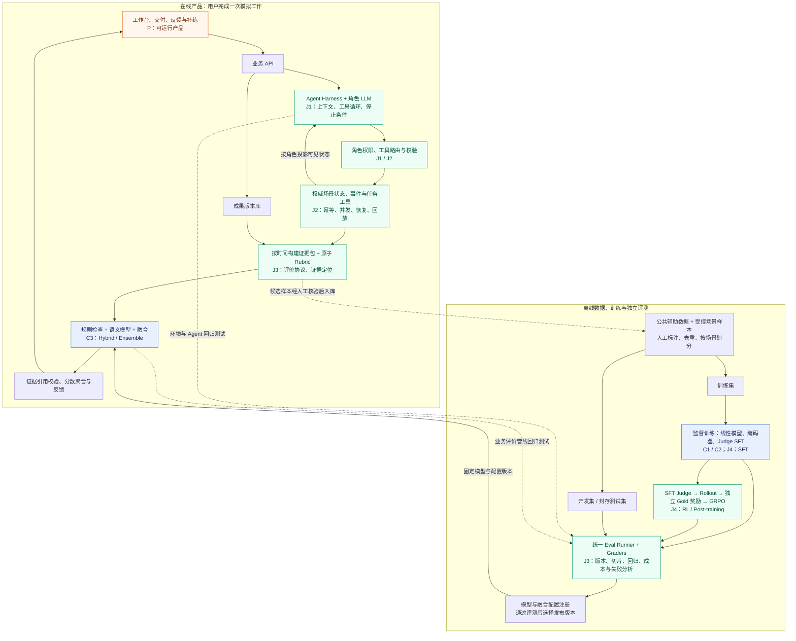
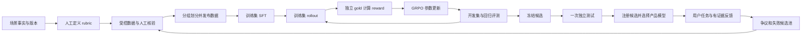

# 职业任务训练场技术设计

版本：0.1　日期：2026-09-26　状态：供团队评审与实施的设计稿

> 历史设计说明：本文保留 2026-09-26 的规划与当时状态。2026-10-04 的最终目标架构见 [RoleCraft 技术框架 v2](../superpowers/specs/2026-10-04-rolecraft-target-architecture-design.md)；最新实现状态见 [README](../../README.md) 与验收报告。

本项目让学生在一个可操作的模拟公司中，完成 AI 产品经理的知识助手试点决策任务。用户与不同角色沟通、阅读材料、测试系统、修改方案，并获得可追溯到材料和行为的反馈。技术核心是有状态的 Agent 运行环境、证据驱动的评价系统，以及通过监督微调和强化学习改善评价模型的判断质量。

本文将已经讨论确定的产品目标与建议的工程参数分开。所有数据规模、阈值、训练参数和成本预算都是初始设计值，不是实测结果或课程规定。没有开展模型训练、用户研究或工程实现。配套实施计划见 [分阶段实施计划](../plans/career-training-implementation-plan.md)，可核对的输入、gold、奖励边界及反事实样例见 [评价样例包](../examples/judge-case-bundle.json)。

## 目录

1. [目标与交付边界](#1-目标与交付边界)
2. [课程与求职能力映射](#2-课程与求职能力映射)
3. [产品场景与可验证结果](#3-产品场景与可验证结果)
4. [系统架构与技术选型](#4-系统架构与技术选型)
5. [统一对象与版本契约](#5-统一对象与版本契约)
6. [数据来源与使用策略](#6-数据来源与使用策略)
7. [领域数据生产与标注](#7-领域数据生产与标注)
8. [数据清洗划分与发布](#8-数据清洗划分与发布)
9. [Agent Loop 与 Harness](#9-agent-loop-与-harness)
10. [任务工具与知识助手](#10-任务工具与知识助手)
11. [Rubric 与用户评价](#11-rubric-与用户评价)
12. [Judge 模型与融合](#12-judge-模型与融合)
13. [Eval Infrastructure](#13-eval-infrastructure)
14. [RL 目标与奖励](#14-rl-目标与奖励)
15. [训练系统与算力预算](#15-训练系统与算力预算)
16. [数据评测训练产品闭环](#16-数据评测训练产品闭环)
17. [实验矩阵与结果解释](#17-实验矩阵与结果解释)
18. [产品验证与学习效果](#18-产品验证与学习效果)
19. [API 存储与运行](#19-api-存储与运行)
20. [交付节奏与团队分工](#20-交付节奏与团队分工)
21. [风险取舍与验收](#21-风险取舍与验收)
22. [研究与文档来源](#22-研究与文档来源)

## 1 目标与交付边界

### 1.1 用户可以完成什么

用户扮演新入职 AI 产品经理，完成一次约 20–30 分钟的试点决策任务。一次有效使用包含：接收任务、获取必要信息、至少一次实际测试、提交配置与方案、查看带证据的反馈。随后提供条件不同的补练任务。完成时间是体验设计目标，应根据试用调整。

### 1.2 功能成功与研究成功

| 层级 | 成功的直接证据 | 不能替代它的指标 |
|---|---|---|
| 产品可用 | 用户能独立完成任务，成果可保存，反馈能帮助定位具体问题 | 页面数量、Agent 数量 |
| 环境可靠 | 角色事实一致、状态转换正确、暂停恢复不丢操作 | 对话听起来像真人 |
| 评价可信 | 在独立人工核验样本上准确识别问题并引用充分证据 | Judge 自称有信心、反馈很长 |
| RL 有用 | 相比相同底座的 SFT，独立测试上的判断或证据质量改善 | 训练 reward 上升 |
| 学习有效 | 用户在新的无提示任务上表现改善，有合适对照与局限说明 | 原题重做得分提高、满意度 |

### 1.3 首版范围

- 一个岗位：AI 产品经理。
- 一个核心任务族：企业知识助手试点决策。
- 三个主要角色：主管、技术负责人、业务负责人；试用员工反馈先作为材料提供。
- 一个主任务和两个可体验变体；后台训练数据可包含更多独立微场景。
- 一个可运行的知识助手与可配置的测试环境。
- 三类核心机器学习任务：事实关系分类、证据选择、原子评价项判断。
- 规则驱动的补练推荐。
- 单机运行的服务、任务队列与评测 runner；单卡或租卡完成小模型 SFT 和 RL 试验。

### 1.4 依赖分级

| 分级 | 当前必须解决的事 | 可以不等待它的工作 |
|---|---|---|
| M0 核心路径 | 一个可解场景、状态与权限、可提交成果、最小反馈、进度保存 | 其他模块可先使用固定夹具开发 |
| M1 选择与验证 | 人工核验开发集、基线、奖励测试、评测报告 | 不阻止用户工作台和场景体验开发 |
| M2 后续证明 | 较大用户试验、跨岗位泛化、多机调度、正式学习效果结论 | 不阻止课程 MVP 交付 |

下一项产生价值的工作：让一个真实试用者跑通短任务，并用一份人工写好的证据反馈复盘；模型训练与此并行推进，而不是先搭完训练平台。

## 2 课程与求职能力映射

### 2.1 5002 课程要求

依据目录内 FT 项目说明，团队最多 5 人，项目需覆盖列出的四类技术中的至少三类。使用前三类构建明确证据，不把 RAG、多 Agent 或 RL 自动等同于课程类别。

| 课程方面 | 本项目实现 | 应提交的可核验材料 |
|---|---|---|
| 监督学习 | 判断—证据关系、原子 rubric 标签 | 标注规范、划分清单、混淆矩阵、类别指标 |
| ML / DL | TF-IDF 线性基线、编码器、生成式 Judge 微调 | 配置、权重、训练曲线、同集对照 |
| Hybrid / Ensemble | 线性模型与编码器的概率融合；规则与语义评价的分工 | 融合权重选择、单模型与融合消融 |
| 智能感知 / sense making | 文本证据理解可讨论，但不作为必需达标项 | 不强行将其算作已满足 |

课程整体项目占 50%，包括首次汇报 5%、最终汇报 10%、报告 15%、系统 15%、互评 5%。FT 文件列出 proposal 9 月 30 日、首次汇报 10 月 6 日、最终交付 10 月 31 日。仅在团队确属 FT 非 Aramco 时采用；PT/Stackable 日期另有材料。最终交付还需数据、代码、模型文件、两次 slides、10–15 分钟视频及各成员 1–2 页个人报告。

来源：[FT 项目说明](../../For%20FT%20students%20only%20%28excluding%20Aramco%20students%29/PRS-PatternRecognitionSystems-Practice-Module%207.0%20-%20FT.pdf)，第 5、6、8、9、15、16 页。

### 2.2 求职重点与个人证据

| 方向 | 本项目应做深的部分 | 面试时可以拿出的证据 | 不应夸大的部分 |
|---|---|---|---|
| Agent Loop / Harness | 可见信息投影、工具协议、事件状态机、恢复、版本一致性 | 状态转换测试、故障轨迹、回放演示 | 多个 prompt 不等于复杂多 Agent 系统 |
| Agent infra | 会话调度、幂等、并发隔离、模型适配、限额 | 并发与恢复实验、调用成本与延迟 | 单机不包装成分布式平台 |
| Eval infra | 数据 manifest、可重跑 trial、grader 版本、切片、置信区间、差异报告 | 一条命令复现、失败分类、版本回归 | 没有人类核验不能称可靠职业测评 |
| RL / Post-training | 同底座 SFT→GRPO、可验证奖励、rollout 记录、held-out 评测 | 真正参数更新、曲线、消融、负结果 | SFT、DPO 或 prompt 调参不能混称 GRPO |
| Model infra | 模型与 adapter 注册、推理适配、批处理、回退、性能记录 | checkpoint provenance、OOM 定位、资源表 | 不能宣称做过内核优化或大规模训练 |
| 数据工程 | lineage、场景分组划分、语义去重、人工裁决 | data card、泄漏检查、标注分歧 | 合成条数不等于独立场景数 |

建议用户主责 Harness + Eval infra，并与模型负责人共同完成 RL。保存自己的设计决策、代码提交、实验和错误修复，团队总成果与个人贡献分开描述。

## 3 产品场景与可验证结果

### 3.1 参考场景

主管要求一周内启动知识助手试点。事实账本包含：索引更新延迟 24 小时、容量上限 30 人、可用开发资源 3 人日、实时同步需要 5 人日、部分知识域变更频繁。任务中途触发一次明确事件，例如演示提前或某份政策文件更新。

用户可以选择小范围开放稳定知识域、限制易过期能力、申请资源后延后试点等路径。不同路径都可能合理。是否达标由约束与结果判断，不固定唯一方案，也不默认拒绝上线更好。

### 3.2 结构化交付

最终成果包含：目标用户、知识范围、人数、更新策略、fallback 条件、开发工作项、验收测试、成功指标、观察窗口、退出条件、简短取舍说明。每一项允许关联材料版本或测试记录。

结构化表单降低模型抽取难度；自由文本用于表达理由。不能因为用户没有重复某个术语就扣分：已提交配置、工具结果和等价表达都应计入。

### 3.3 任务结果分两层

1. 确定性检查：人数是否超限、工作项成本是否超预算、引用记录是否存在、配置是否支持目标测试。
2. 开放判断：是否识别主要取舍、解释是否得到证据支持。保留多种可接受方案及人工复核路径。

模拟得到的是该场景规则下的覆盖、失败与成本，不是真实企业 ROI，也不是用户将来胜任岗位的预测。

## 4 系统架构与技术选型

图中标记表示计划对应关系，不代表已实现或已经获得课程认可。课程技术覆盖以 C1、C2、C3 三类为主；求职方向按用户希望展示的能力标记，不代表某一家公司的招聘标准。

| 标记 | 对应要求或能力 |
|---|---|
| P | 课程的真实问题、可运行系统与产品演示 |
| C1 | 监督 / 无监督学习类别：本项目选择监督学习 |
| C2 | ML / DL 类别：线性基线、编码器与 Judge 训练 |
| C3 | Hybrid / Ensemble 类别：概率融合与规则—语义混合评价 |
| J1 | Agent Loop / Harness |
| J2 | Agent infra |
| J3 | Eval infra |
| J4 | RL / Post-training |



### 4.0 图中对应关系如何得到证明

| 对应点 | 必须实际完成的工作 | 用于课程或面试展示的证据 |
|---|---|---|
| C1：监督学习 | 将判断—证据关系或原子 rubric 项转成有标签任务，按独立场景划分并训练 | 标注规范、数据划分、混淆矩阵、Macro-F1 |
| C2：ML / DL | 在相同测试集比较 TF-IDF 线性模型、训练后的编码器及 Judge | 训练配置、模型文件、曲线、同集实验结果 |
| C3：Hybrid / Ensemble | 在开发集选择线性模型与编码器的融合权重，测试单模型与融合；说明规则和语义判断边界 | 单模型 / 融合 / 去除规则的消融与失败案例；如无提升如实报告 |
| J1：Agent Loop / Harness | 实现有界工具循环、权限上下文、停止条件和异常处理 | 一条完整工具轨迹，以及工具失败后的处理演示 |
| J2：Agent infra | 实现事务状态更新、幂等、任务恢复、会话隔离和追踪 | 重复请求、任务中断恢复、并发隔离测试及延迟 / 成本记录 |
| J3：Eval infra | 对 Agent 环境与 Judge 使用版本化数据、独立 graders、可重跑 trials 和差异报告 | 一条命令复现的评测报告、错误切片、模型版本对比 |
| J4：RL / Post-training | 从同一 SFT checkpoint 出发，用可核验标签与证据奖励训练 Judge，保存 rollout 和真实参数更新 | SFT vs GRPO 的独立评测、奖励消融、资源消耗；训练 reward 上升不能代替准确率提升 |
| P：课程产品交付 | 用户能完成模拟任务、提交成果、查看证据反馈并体验补练 | 可运行系统、演示视频、用户试用记录；另按课程要求提交报告、slides 与个人材料 |

三个关键边界：

- C1、C2、C3 是课程文件中的不同类别，同一个 Judge 子系统可以支撑多个类别，但每类都需要具体实现和实验。多个模型、多个 Agent 或接入 RAG 本身不等于满足三个类别。
- 在线评价回答“这位用户这次做得怎样”；离线 Eval infra 回答“评价模型和 Agent 系统是否可靠”。两者共享输入契约与证据格式，离线验证依赖独立 gold，而不能让同一个 Judge 为自己证明正确。
- RL 首版训练对象是 Judge。训练集 gold 提供奖励，开发集用于调试与选型，封存测试集用于最终确认；角色同事、用户补练推荐不在首版 RL 范围。线上失败进入候选池须经核验，不能自动把 Judge 自身判断当成真值。

### 4.1 默认实现

| 层 | 首版建议 | 选择理由 |
|---|---|---|
| UI | React + TypeScript，Vite | 工作台、时间线与配置表单直接实现 |
| API | Python 3.11，FastAPI，Pydantic | 共享模型与数据 schema |
| 状态 | PostgreSQL；最初纯逻辑测试可用内存实现 | 事务、JSONB、行级并发控制 |
| 后台任务 | PostgreSQL jobs 表 + 单独 Python worker | 先支持 lease/retry，不立即引入 Redis |
| 文件 | 本地内容寻址目录 | 文档、模型、报告用 sha256 引用；后续可换对象存储 |
| 检索 | SQLite FTS/BM25 或 PostgreSQL 全文检索 | 小材料库先保证可解释；向量检索作为对照扩展 |
| Agent 编排 | 显式 Python 状态机与 model adapter | 接口可控，不同时堆多种编排框架 |
| ML | scikit-learn、PyTorch、Transformers | 线性与神经基线 |
| SFT / RL | 独立 Linux Python 3.11 环境，TRL + PEFT | 与产品服务隔离，记录实际兼容锁文件 |
| 追踪 | 结构化 JSONL + SQL 索引；可选 OpenTelemetry 导出 | 原始轨迹可查、可重评分 |
| 运行 | Docker Compose；Windows 前端开发，训练用 Linux/WSL2 或租卡 | 不把原生 Windows GPU 兼容性作为项目研究内容 |

以上是候选栈，不是假定已验证的依赖组合。首次 20 个训练 step 冒烟测试后，将实际 Python/PyTorch/CUDA/Transformers/TRL/PEFT 版本写入锁文件与 run manifest。若依赖要求更新 Python，仅训练容器独立调整并记录。避免引用 `latest` 作为实验身份。

### 4.2 产品与训练分离

- 产品中的角色 LLM 可使用固定 API 模型；被训练的是独立 Judge。
- 基线、SFT、RL Judge 使用同一个可本地训练的底座，以隔离训练方法影响。
- 用户运行中的模型版本不热替换；新 session 采用新版本，历史反馈保留原版本。
- 单 GPU 上在线推理与训练分时运行；演示不依赖训练作业同时占卡。

## 5 统一对象与版本契约

### 5.1 核心对象

| 对象 | 必需字段 | 用途 |
|---|---|---|
| ScenarioSpec | scenario_id, family_id, version, seed, roles, facts, documents, events, constraints | 定义场景 |
| Session | session_id, scenario_version, actor_id, status, state_version | 用户的一次任务 |
| WorldState | session_id, version, logical_time, resources, configs, material_versions | 当前权威状态 |
| Action | action_id, idempotency_key, expected_version, actor_id, tool, arguments | 写操作入口 |
| Event | event_id, seq, event_type, actor_id, payload, before_version, after_version | 已发生的事实 |
| Artifact | artifact_id, session_id, version, content_hash, media_type, created_at | 文档与交付 |
| EvidenceRef | kind, object_id, version, span_id, observed_at_seq | 精确定位证据 |
| JudgeInput | item_id, input_hash, as_of_seq, criterion, claim, candidate_evidence | 模型可见输入 |
| GoldAnnotation | item_id, annotation_version, label, acceptable_evidence_sets, adjudication | 训练与独立评分标签 |
| JudgeDecision | label, evidence_ids, reason_code, explanation, model_revision | 模型输出 |
| EvalRun | run_id, dataset_hash, grader_version, model_revision, decode_config, seeds | 可追溯评测 |

### 5.2 四种可见范围

1. world-private：角色私有事实与尚未触发事件。
2. role-visible：当前角色可检索和引用的信息。
3. learner-observed：用户实际接触到的材料与工具结果。
4. evaluator-only：gold 标签、可接受证据集合、完整评分元数据。

最终成果的客观约束可对照当前 world truth 检查；评价早先判断是否合理，必须按其 `as_of_seq` 与可获得信息处理。某事实当时完全不可获取，不得以“未识别它”扣分。信息是否可获取与用户是否实际调查需分别记录。

GoldAnnotation 不能被序列化进模型 prompt、RAG 索引、角色工具返回值或前端 API。`candidate_evidence` 是中性材料，不包含 gold 支持/反对标记。训练 reward 服务按 item_id 在另一张表查询 gold。

### 5.3 版本固定

一次可复现运行的身份至少包括：代码 commit/源文件 hash、容器 digest、场景 hash、数据 manifest hash、rubric hash、reward hash、模型与 tokenizer revision、adapter hash、prompt template hash、seed、解码配置、工具缓存模式。

历史 label 不因 rubric 更新被覆盖。重新评分产生新的 run_id，保存旧结果；rubric 或 verifier 修订后，所有待比较模型必须在同版规则上重跑。

## 6 数据来源与使用策略

### 6.1 数据源清单

| 来源 | 已核实内容 | 项目用途 | 不能证明的东西 |
|---|---|---|---|
| [FEVER](https://fever.ai/dataset/fever.html) | 185,445 条声明；SUPPORTS / REFUTES / NOT ENOUGH INFO；前两类有证据 | 可选的证据关系训练与外部能力检查 | PM 工作评价或中文能力 |
| [ContractNLI](https://stanfordnlp.github.io/contract-nli/) | 607 份标注合同；entailment / contradiction / not mentioned，证据定位 | 约束、否定、例外与长文档推理参考 | 真实职场决策优劣 |
| 自建场景事实账本 | 团队定义的角色、资料、约束、版本和事件 | 领域内可控样本与程序标签 | 不代表真实职场分布 |
| 受控合成文本 | 基于固定账本生成的方案、对话、行为片段 | 增加表达、多种错误与困难负例 | 不能替代人类数据 |
| 真实试用成果 | 用户实际操作、成果、争议和人工修正 | 最终适用性检查与下一版数据 | 小样本不足以证明长期学习提升 |
| [RewardBench](https://github.com/allenai/reward-bench) 等 | 评价模型基准与工具 | 可选的外部 sanity check | 不应混入本项目训练后仍当独立测试 |

主路线只选择一个公开来源先做通。考虑获取和证据还原成本，建议先用 ContractNLI 的自带全文 JSON 做管线验证；FEVER 的训练子集作为扩展，避免第一周被 Wikipedia 快照处理占满。领域训练主体仍是自建 PM 数据，合同语料只是辅助。团队可选择公开数据仅用于基线，领域 SFT/RL 完全使用自建数据，并报告两种来源的贡献。

### 6.2 数据获取与授权记录

每个来源写 `source_registry.json`：source_id、官方链接、下载日期、实际文件 URL、revision、sha256、许可证链接与快照、用途、字段、原始 split、语言、再分发方式。不能把网页文章许可证自动当作数据许可证；实施时从实际下载入口核对。

FEVER 的 evidence 字段是句子定位信息，不等于已经包含全部证据正文。需用官方对应 Wikipedia 快照解析页面和句子 ID，保存来源句子映射；无法解析的记录隔离并报告，不以当前网页内容静默替代历史快照。首版只取训练子集中带完整证据的有限记录，避免下载和处理整个检索基准成为阻塞。

ContractNLI 按官方 JSON 的文档、假设、证据 span 导入；字符偏移以原始文本为准。清洗会改变偏移时，另建 offset map，不直接沿用旧 offset。官方页面明确数据为 CC BY 4.0，下载时仍记录实际文件与许可证快照。

ContractNLI 包含固定的 17 个假设，因此报告主要说明跨文档判断，不宣称泛化到未见假设。其 span 标注包含应识别的证据，不能未经审核就当成唯一“最小充分集合”；第一版保留原证据识别指标，只有转成经核验的充分集合后才用于 grounded RL。NotMentioned 的空 span 也不能被解释成文档缺失。

两种数据的源标签映射固定为 Entailment/SUPPORTS→SUPPORTED、Contradiction/REFUTES→CONTRADICTED、NotMentioned/NOT ENOUGH INFO→INSUFFICIENT。它们只适配 relation，不自动变成职业 rubric 的 MET/PARTIAL 标签。来源自带的 train/dev/test 隔离优先保留，再在 train 内划分项目开发子集；不得把源测试拼回训练。

### 6.3 语言策略

产品和主要领域测试使用中文；保留英语公开集用于基础训练/外部检查。使用多语言编码器或中英模型，不宣称英文分数能代表中文。

如翻译公开样本：保留 parent_id 与原文、记录翻译模型 revision、人工抽检否定/数量/时间/例外、源文与译文放在同一 split。翻译数据单列指标，不能宣称为独立中文人工 gold。

### 6.4 规模与成本的建议档位

| 阶段 | 建议规模 | 实际目的 |
|---|---|---|
| 标准验证 | 60–100 条，覆盖至少 6 个微场景 | 发现标签歧义与标注耗时 |
| 课程数据 v1 | 约 12–20 个独立微场景模板，合计 800–1,500 个原子评价项 | 跑通基线、SFT、小规模 RL；泛化结论有限 |
| 扩展 v2 | 约 30–50 个模板，2,000–5,000 个评价项 | 更有意义的场景外评测与稳定实验 |
| 真实试用 | 首轮 5–8 人可用性，后续约 12–20 人探索性验证 | 找到真实输入分布与产品问题 |

完整可玩剧情不必有 20 个；训练微场景是围绕一次判断的短材料包。条数、模板数、独立事实配置数都必须报告。规模不保证 RL 有效，也不能根据小样本 CI 作过强推广。

人工成本估算：先量出单条平均标注分钟数 m；N 条单人标注约 N*m/60 小时，双标比例 q 额外约 q*N*m/60，再加裁决。示例 N=300、m=3、q=0.3 时约 19.5 人小时，尚未计裁决；这只是算例。

## 7 领域数据生产与标注

### 7.1 先分组再生成

先定义独立场景模板与其 split，再在模板内部生成事实配置、正负例和改写。`family_id` 表示业务能力族，`template_id` 表示具体因果结构，`root_case_id` 表示事实实例。最小泄漏隔离单位是 template_id；若两个模板仅换名而因果结构相同，应合并 group。

场景能力覆盖：时间版本、容量、资源依赖、测试覆盖、未知信息、合理替代方案。训练、开发、测试均可含这些能力，但不能共享相同事实与文本派生树。

### 7.2 样本生成流水线

1. 场景作者写事实账本，确认预算和事件的可行性。
2. 从固定 rubric 中选择一个原子 item，不把整个“PM 能力”作为单标签。
3. 构建一个或多个可接受方案，以及明确的局部错误。
4. 程序生成数值/时序/权限等可验证标签；语义标签由人工确认。
5. LLM 只负责自然语言表达和干扰材料，不负责最终确立 gold。
6. 保存可控变换信息：改了哪个事实、期望标签是否改变。
7. 检查文本是否引入了未定义事实，交给人工抽查与难例裁决。
8. 生成模型输入包与 gold sidecar，分开存储。

### 7.3 变换库

| 变换 | 例子 | 正确性检查 |
|---|---|---|
| 数值边界 | 30 人上限下提交 29/30/31 人 | 程序比较 |
| 时间版本 | 更新前引用旧版，更新后仍引用旧版 | as_of_seq + valid interval |
| 信息缺失 | 删除能支持收益预测的记录 | 确认剩余材料不足；不是简单反驳 |
| 干扰证据 | 引用真实但无关的测试记录 | 证据集合与 rubric 相关性人工确认 |
| 条件例外 | 已批准增加资源，使原超预算方案可行 | 检查授权事件与有效时间 |
| 表述扰动 | 短答、长答、口语、中性专业表达 | 保持语义，防长度捷径 |
| 合理替代路径 | 限定知识域或延后上线均可达标 | 多组接受条件 |
| 操作证据替代 | 文案没说测试，但操作日志证明测过 | 合并行为与成果证据 |

同一标签中平衡长短、专业程度、语气与姓名。增加“谨慎但没有完成任务”的反例和“积极但有充分证据”的正例，避免保守偏置。

### 7.4 标注单位与标签

任务 A `relation`：SUPPORTED / CONTRADICTED / INSUFFICIENT。

任务 B `criterion`：MET / PARTIAL / NOT_MET / INSUFFICIENT / NOT_APPLICABLE。

任务 C `evidence`：允许多个最小充分证据集合，例如 `[e1,e2]` 或 `[e3]`。证据评价不能只验证 ID 存在，也不能强迫唯一定位。

`review_required` 是服务路由标记，不是上述语义标签。模型没把握、检索失败、日志缺失与“材料本来不足”必须分开。只有前者触发复核；后者可能是正确的 INSUFFICIENT 判断。

### 7.5 Gold 来源分级

- G0：程序可证明的局部约束，记录 verifier ID 与版本。
- G1：人工核验的语义关系与充分证据，记录 annotator 与裁决。
- G2：仅模型生成的弱标签，仅用于探索或低权重 SFT，不进入主要 RL 奖励和最终 gold 测试。

自动验证不意味着标签永远正确。新增 verifier 必须用正例、反例、边界、例外各类测试检验；训练成功也不能证明 verifier 正确。

### 7.6 标注流程

两位成员先独立标注首批 30 条，讨论分歧，更新手册后再扩充。最终测试建议全部双标并裁决；训练集可抽样双标。记录原始判断，不能只保留最终一致标签。

报告 raw agreement、Cohen's kappa（两人类别标注），序数 0/1/2 分可报告 weighted kappa，注明类别不平衡影响。证据集合报告 token/span overlap 与“是否充分”的裁决，不把 overlap 当逻辑有效性的替代。

### 7.7 一条样本应保存什么

```json
{
  "item_id": "pm_capacity_case_017_item_01",
  "template_id": "capacity_with_approved_exception",
  "root_case_id": "case_017",
  "family_id": "resource_constraints",
  "split": "train",
  "task_type": "relation",
  "language": "zh",
  "criterion_id": "R3.capacity_claim",
  "claim": "50 人试点没有超过当前获批上限。",
  "as_of_seq": 12,
  "candidate_evidence": [
    {"id": "e1", "object_id": "capacity_policy", "version": 1, "text": "试点人数上限为30人。"},
    {"id": "e2", "object_id": "approval", "version": 1, "text": "本次没有批准增加试点人数。"}
  ],
  "gold_ref": "gold/case_017_item_01.json",
  "provenance": {"kind": "controlled_synthetic", "label_tier": "G0", "transform": "exceed_limit"}
}
```

`gold_ref` 属于数据管理记录，组装 prompt 时必须通过白名单丢弃。另存 gold：label=CONTRADICTED；可接受证据集合按具体例外语义规定，不能把 `e1` 和 `e1+e2` 默认视为等价。

## 8 数据清洗划分与发布

### 8.1 清洗规则

- Unicode 与空白规范化保留原文和偏移映射；不丢弃否定词、单位、时间和文档版本。
- 文档按语义段切分，保留标题、父级、span_id；约 200–400 个中文字只是初值，token 限额以 tokenizer 实测。
- 精确 hash 去重；对近重复使用词 n-gram / MinHash 与抽检，特别检查跨 split 的正负例派生关系。
- 对结构化标签检查合法枚举、引用存在性、有效时间、来源和可接受集合非空条件。
- INSUFFICIENT 的 gold 必须注明缺什么，以及证据包是否完整；检索遗漏不能自动成为 gold 信息不足。

### 8.2 两个评测轨道

**证据给定轨道：**提供完整相关候选材料，测 Judge 判断能力。作为 SFT/RL 的首版任务。

**端到端轨道：**从实际 session 检索、抽取、组装证据，再评价。分开报告 retrieval recall、判断质量和覆盖率，避免将检索失误归咎于 Judge 或把 oracle evidence 成绩当产品成绩。

### 8.3 划分与访问

建议按 group 数量约 60/20/20 分 train/dev/test，不按行随机切分。小模板数时不机械追求比例，先保证每个类别与能力切片可评估。额外保留少量未见业务主题为 OOD，仅在规模允许时做。

所有 teacher 改写、翻译、轨迹片段、pairwise 对及事实扰动继承 root group。测试模板不得进入 few-shot、prompt 调参、SFT、RL、失败挖掘或选择 checkpoint。开发失败可回流训练，但需把相关 group 整组迁移并发布新的 split manifest。

最终测试由一次候选冻结后的确认性评测使用。若依据其结果改了模型，这套测试转为开发材料，下一轮需要新独立测试才能再次声称独立验证。常规迭代使用 dev 与回归集。

### 8.4 发布目录

```text
data/releases/v1/
  manifest.json
  sources.json
  data_card.md
  splits/train.jsonl
  splits/dev.jsonl
  splits/test.inputs.jsonl
  gold/train.jsonl
  gold/dev.jsonl
  gold/test.jsonl
  lineage.jsonl
  audit_report.json
```

gold/test 仅 evaluator 进程挂载；产品、生成脚本和 trainer 不可读。manifest 列文件 hash、样本数、模板数、标签分布、语言分布和已知局限。真实试用数据使用化名并记录允许用途，删除联系方式等不必要信息；用户拒绝研究使用时，仍可使用产品但不进入训练池。

## 9 Agent Loop 与 Harness

### 9.1 单次角色回合

```text
接收用户消息
→ 验证 session / actor / action id
→ 从当前版本生成该角色可见视图
→ 组装角色指令、已确认事实与近期对话
→ 调用模型
→ 若提出工具调用，校验参数与权限并执行
→ 把真实工具结果返回模型，最多 3 次工具循环
→ 保存最终回复及引用
→ 返回 UI
```

每个用户请求最多 4 次模型调用（含工具循环后的最终回复），默认单次 provider timeout 45 秒、传输失败最多 2 次重试，均作为可配置初值。回合达到上限时返回可理解的阶段状态，不伪造已完成。

角色回复中的承诺不是数据库状态。`propose_change` 只产生提议；明确的用户动作或场景规则才触发 `apply_change`。角色可有不同立场，但不能擅自篡改事实。

### 9.2 状态与并发

状态修改请求必须包含 expected_version；冲突返回 409 与最新版本摘要。以 `(session_id, idempotency_key)` 唯一约束避免重复写入。事件和状态快照在同一事务提交。

后台 job 使用 lease、attempt、lease_expires_at 与 heartbeat。worker 崩溃后可重新领取；job completion 以 output hash 和幂等键提交。第三方模型请求不能承诺 exactly-once；本地确保一次业务提交，重复 API 成本单独记录。

### 9.3 记忆与角色隔离

权威事实来自 world state，不从聊天摘要反向写回。角色记忆包括稳定身份、已见事实引用、未解决提议与短对话摘要；摘要保留原始 event refs。上下文压缩不删除尚未解决约束。

过滤在检索前执行，不能只靠提示词写“不要泄露”。向量/全文索引命中后仍二次检查访问权限及版本。另一角色的私有事实、rubric gold 和未来事件不进入 prompt。

### 9.4 暂停恢复与回放

- 暂停：保存最后提交状态、未完成 job、角色上下文引用。
- 恢复：重建可见视图，继续未完成任务；对已完成写操作不重复执行。
- 回放：展示已保存的 event、回复和工具结果，不再次调用模型。
- 重新运行：使用相同 manifest 与初始场景，但新的 trial_id，允许模型随机性。

### 9.5 故障模型

| 故障 | 处理 | 归类 |
|---|---|---|
| provider 超时/限流 | 有界重试；保留 job 状态 | infrastructure_error |
| JSON 格式不合法 | 至多一次格式修复；保留原输出 | model_format_error |
| 工具越权/参数错误 | 返回结构化错误，不改变状态 | invalid_action |
| 角色说错事实 | 记录事实一致性失败，开发集回归 | actor_factual_error |
| 检索材料不足 | 展示受限反馈或待核验，不自动扣分 | evidence_gap |
| evaluator 自身异常 | 此项不评分，保留错误并重试 | grader_error |

有恢复机制并不意味着错误被抹去：首次失败与最终状态分别统计。

## 10 任务工具与知识助手

### 10.1 工具集合

| 工具 | 输入 | 输出 | 是否修改状态 |
|---|---|---|---|
| list_materials | actor_id, as_of_seq | 当前可见文档列表 | 否 |
| read_material | document_id, version | 段落与 evidence refs | 否 |
| ask_role | role_id, message | 角色回复与引用 | 记录交互 |
| test_assistant | query, assistant_config_version | answer, citations, indexed_versions, trace_id | 生成测试记录 |
| update_pilot | patch, expected_version | 新配置与版本 | 是 |
| submit_plan | artifact_version, config_version | immutable submission | 是 |
| request_feedback | submission_id | feedback_job_id | 创建任务 |

### 10.2 知识助手要真的可测试

至少支持稳定 FAQ、刚更新的政策、超出知识范围的问题三类。源文档版本与索引版本独立：文档更新不自动更新索引，使“更新延迟”成为实际可观察行为。可以通过缩小领域、更新时间提示、特定类别转人工等配置改变结果。

本地可运行路径使用文本检索和可替换生成接口。CI 使用固定检索/回答夹具保证状态测试确定性；产品演示使用真实检索和模型。两种模式在界面和 run manifest 明示，不能把夹具演示当真实模型效果。

测试失败首先来自可验证的来源版本、内容覆盖或配置检查，不需要让一个自由生成 LLM 凭感觉判“过期”。真实回答的语义正确性另由 gold 问答和人工/模型 grader 评价。

## 11 Rubric 与用户评价

### 11.1 Rubric 设计原则

- 评具体成果和行为，不推断人格、潜力或就业适配。
- 一项 rubric 只对应一个可观察要求；抽象能力由多个原子项组成。
- 写明适用条件、可接受证据、等价路径、例外与信息缺失处理。
- 行为过程与最终方案互补，避免同一错误在多个维度重复扣分。
- 判断当时合理性使用当时信息；评价提交方案使用提交时有效约束。
- 不把“询问某个指定角色”设为唯一得分路径，只要获得等效可靠信息即可。
- 反馈以证据和下一步练习为主，不输出未经验证的“职业能力百分位”。

### 11.2 六个维度

| ID | 维度 | 初始权重 | 原子项例子 | 主要证据 |
|---|---|---:|---|---|
| R1 | 目标与范围 | 10 | 指定用户组、业务目标、成功指标 | brief、方案、配置 |
| R2 | 证据与判断 | 25 | 关键事实有依据、引用有效、区分未知与已知 | 文档、测试、结论片段 |
| R3 | 约束与可行性 | 20 | 人数、开发资源、依赖、时间限制得到处理 | 状态、工作项、批准事件 |
| R4 | 测试与验收 | 20 | 覆盖过期信息、范围外请求、正常使用，记录实际结果 | 测试记录、验收标准 |
| R5 | 变化后的调整 | 15 | 事件后更新受影响决策，未受影响项无需无意义改写 | before/after、事件、提交 |
| R6 | 可执行交付 | 10 | 方案、配置、责任人/观察窗口/退出条件一致 | 最终成果与配置 |

这些权重是产品设计初值，不是行业公认标准。首版每维 2–3 个原子项，合计约 12–18 个。没有变化事件的场景，R5 为 NOT_APPLICABLE，按适用维度重新归一化。

### 11.3 标签与评分

MET=2，PARTIAL=1，NOT_MET=0。NOT_APPLICABLE 从分母排除。INSUFFICIENT 不直接当作 0 分，也不悄悄从分母删除后给高分。

对某维度适用项总数 n，已判项分数和 s，未知项 u：

`lower = s / (2*n)`；`upper = (s + 2*u) / (2*n)`；`coverage = (n-u)/n`。

总分上下界为各适用维度的加权和。首版 UI 在存在未知项时优先显示“已确认表现 + 待核验项”，不把下界当正式总分。全部可判时再给辅助分数。日志完整且明确要求交付的字段确实未提交，可判 NOT_MET；日志因故障缺失则为 INSUFFICIENT，两者不同。若所有项都不适用或未生成有效 rubric，返回 unscorable 并提示检查任务，不计算除以零，也不显示满分。

### 11.4 完整原子项示例

```yaml
criterion_id: R4.staleness_test
version: 1
dimension: R4
description: 验证试点范围内文档更新后知识助手的回答表现
applicability:
  requires_mutable_knowledge_in_scope: true
observation_window: session_start_to_submission
met:
  - 存在相关文档更新后的实际测试记录
  - 结果与所用源文档及索引版本可定位
  - 方案或配置响应了观察到的问题，或有证据说明无需调整
partial:
  - 有有效测试，但未把结果用于相关决策
not_met:
  - 记录完整且仍开放相关领域，却未进行该类验证
insufficient:
  - 系统故障导致测试记录缺失或损坏
accepted_alternatives:
  - 明确将动态知识域排除出试点，则此项可不适用，范围与目标的合理性由R1和R3评价
evidence_types: [test_result, document_version, pilot_config, plan_span]
forbidden_shortcuts:
  - 仅在文案中写已充分测试不能算实际验证
```

是否属于 MET/PARTIAL 可以含语义判断；程序先验证记录和版本，模型再判断测试与方案的关联。不应训练 LLM 重复完成一个完全能由数值比较解决的判断，规则可直接保留为强基线。

### 11.5 评价流水线

1. 固定 submission 与 as_of_seq。
2. 构建可评价证据包，记录是否完整和 token 裁剪。
3. 对数值、引用存在性、版本先执行确定性检查。
4. 对自由文本执行 claim 抽取与原子 item 判断。
5. 校验模型引用；冲突与不确定项进入 review queue。
6. 根据已确认 item 计算维度结果与覆盖率。
7. 生成简短反馈：观察到什么、证据在哪里、影响什么、可以怎样改进。
8. 按薄弱维度映射到预先审核的补练任务。

抽取 claim 的错误单独评估；首版表单提供明确“关键判断与依据”字段，减少无控制的长文抽取。LLM 反馈生成不能修改上游 label、证据或分数；输出不符合结构时采用模板反馈。

### 11.6 Rubric 的 meta-evaluation

准备包含合理替代方案、信息缺失、日志故障和时间变化的 gold 子集。让人工按 rubric 评分，再看 Judge 是否一致；再看人工是否认为 rubric 本身误伤合理方案。若标准有问题，修 rubric 和数据版本，不通过训练强迫模型复现错误标准。

证据出现“主管已批准增加人数”时，30 人旧上限不再绝对生效。预算类 rubric 必须检索例外和批准状态，不能只看单一文档关键词。

## 12 Judge 模型与融合

### 12.1 不同模型的职责

| 名称 | 输入与输出 | 用途 |
|---|---|---|
| Rule baseline | 结构化事实与配置 → 约束结果 | 数值/时序强基线与产品可靠路径 |
| Linear baseline | claim 与证据文本的 TF-IDF 特征 → 三分类概率 | 课程 ML 基线，发现词汇捷径 |
| Encoder baseline | claim + 候选证据 → 三分类概率 | 语义识别与融合分支 |
| Base Judge | rubric + evidence + 成果 → 结构化判断 | 未微调生成式模型基线 |
| SFT Judge | 同上 | 学会领域标签、证据 ID 和简短解释 |
| RL Judge | 同上 | 在相同输入任务上优化准确性与证据质量 |
| API teacher / reviewer | 同上或生成任务 | 辅助生成、强模型参照；不自动等于 gold |

首选小模型候选为 `Qwen/Qwen2.5-1.5B-Instruct`，明确因为规模可控、中英与结构化输出适用，而不是声称它是最新或最优。固定实际模型 revision。[模型卡](https://huggingface.co/Qwen/Qwen2.5-1.5B-Instruct)

编码器候选为 `FacebookAI/xlm-roberta-base` 加分类头；这是多语言基座，需要实际微调，不应当成已经训练好的 NLI 模型。长材料采用候选段召回后打包；单段不能包含完整多跳证据时，单独报告长文与多证据失败。[模型卡](https://huggingface.co/FacebookAI/xlm-roberta-base)

### 12.2 输入预算

Judge v0 使用证据给定、单条原子 item 的输入。最大 prompt 初值 2,048 tokens，输出 256 tokens；长上下文切片可扩至 4,096，但必须另做显存和吞吐测试。

输入超长不能静默截掉决定性证据。assembler 按结构保留 criterion、claim、时间与证据；截断后若无法维持充分材料，标注 assembly_status=overflow，转分段评测或待核验。训练与测试使用同一 assembler，oracle 与 retrieved 模式分别记录。

### 12.3 输出协议

```json
{
  "label": "CONTRADICTED",
  "evidence_ids": ["e1", "e2"],
  "reason_code": "CAPACITY_EXCEEDED",
  "explanation": "当前上限为30人且没有扩容批准，50人方案与约束不符。"
}
```

输出解释是可展示的简短证据说明，不要求长思维链。训练主目标是最终判断与证据；文字风格和长篇推理不作为奖励捷径。`reason_code` 为有限枚举，未知时用 OTHER 并留人工检查，不把代码枚举反向暴露 gold。schema validator 根据 task_type 限制标签集合，relation 不能输出 MET，criterion 不能输出 SUPPORTED；evidence_ids 不允许重复。

### 12.4 监督训练

- 编码器：cross-entropy，标签不平衡时在训练集内选择 class weight；所有预处理只拟合训练集。
- SFT：assistant completion loss，输入 prompt 不计目标 loss；先以少量样本核对 chat template 与 mask，再训练。
- 训练标签与说明由 G0/G1 来源组成；可只训练 label/evidence 的短输出，不需要人为编造长推理过程。
- 公共 NLI 辅助数据与领域数据分桶，分别报告混合前后效果；不允许大规模英文样本淹没中文领域分布。
- 第一版 1–2 epoch 起步，在 dev 上选 checkpoint。训练模型与部署模型的 tokenizer、chat template 保持一致。

### 12.5 有意义的集成

在同一个三分类子任务上，线性模型和编码器均输出归一化概率：

`p_ensemble = alpha * p_encoder + (1-alpha) * p_linear`。

alpha 在 dev 上从 0、0.25、0.5、0.75、1 选择，不在 test 上调。即使最优 alpha=1，也应报告集成未带来收益，不能只为课程美化结果。若要将生成式 Judge 融入，先定义其可靠概率提取/校准方式，不能把自述置信度与分类概率直接平均。

产品可用规则 + Judge 的混合架构：规则决定直接可验证事实，Judge 处理语义关联；两者冲突时给出冲突状态并复核。这个架构与上述概率集成是两个不同实验。

## 13 Eval Infrastructure

### 13.1 三套独立 suite

| Suite | 被测对象 | 数据 | 输出 |
|---|---|---|---|
| environment | Harness、角色与工具 | 固定动作脚本、角色事实查询、故障注入 | 状态正确性、隔离、恢复、成本 |
| judge | 模型、证据组装和 grader | gold 原子 item、难例、真实用户成果 | 准确性、证据、稳定性、覆盖与延迟 |
| learning | 产品训练流程 | 人类前测/训练/迁移任务 | 可用性与探索性学习效果 |

此外保留 reward-unit suite，测试 RL 奖励的边界和漏洞。它不是模型效果证明。

### 13.2 Runner 的工作单元

`EvalJob` 包含任务列表；每个 `Trial` 是一个 task × candidate × seed × input_mode 的尝试。trial_id 可由规范化配置 hash 生成；重复调用默认复用同一 trial 结果，显式 replicate_id 才创建重复试验。

runner 流程：加载并验证 manifest → 构造只含 input 的请求 → 新建隔离环境/缓存命名空间 → 调用 candidate → 保存原输出与 token/时间 → 调用固定 grader → 生成逐项结果 → 按 group 聚合 → 与 baseline 比较 → 输出报告。

借鉴任务、环境、trial、job 的分层思想，但首版自建轻量 runner 即可，不必须集成完整外部框架。[Harbor 文档](https://docs.harborframework.com/)

### 13.3 Grader 分工

| Grader | 输入 | 判断 | 自身验证 |
|---|---|---|---|
| schema_grader | raw model output | JSON、枚举、ID 格式 | 错误 JSON / 多余字段测试 |
| label_grader | prediction + gold label | 标签正确 | 固定 gold 夹具 |
| evidence_grader | refs + acceptable sets + material metadata | 引用有效性、覆盖、充分性 | 替代集合、过期、无关、缺失证据 |
| constraint_grader | world snapshot + config | 人数/预算/依赖/时间 | 边界与例外用例 |
| consistency_grader | 扰动前后的完整预测 | 语义不变时均正确、变化时正确翻转 | 双样本固定标签 |
| human_review | 材料、预测、rubric | 开放语义与争议判断 | 隐藏模型身份，保存原始评分 |

Judge 作为被训练模型，不能同时充当自己测试结果的最终裁判。teacher 只产生弱标签的样本不计入 human-gold 主指标。

### 13.4 指标定义

| 指标 | 精确定义或报告方式 |
|---|---|
| relation Macro-F1 | 三个关系标签各自 F1 的平均；另报 support、混淆矩阵 |
| criterion Macro-F1 | 五类标签分别计算；按适用条件检查 N/A，不允许滥用 |
| false deduction rate | gold=MET、预测=NOT_MET 的项数 / gold=MET 项数；另报严重低估率 |
| false pass rate | gold=NOT_MET、预测=MET 的项数 / gold=NOT_MET 项数 |
| evidence validity | 所引用 refs 中确实存在、版本有效、范围允许者占比 |
| evidence set F1 | 与每组可接受充分集合计算集合 F1，取最优；不能代替逻辑充分性审查 |
| joint correctness | 标签正确且命中一个有效充分集合的样本比例；INSUFFICIENT 按其缺失规则核验 |
| review coverage | 可自动给出有效结果的适用项数 / 全部适用项数；与该覆盖下错误率同时报告 |
| perturbation robust accuracy | 原样本和语义等价扰动均正确的 pair 比例 |
| counterfactual flip accuracy | 事实改变的两个版本均输出各自正确标签的比例 |
| format failure | 原始模型输出无法解析比例；修复后成功率另报 |
| infra failure | 请求/环境错误比例，与模型错误分开 |
| latency/cost | 端到端 p50/p95、各阶段时间、输入输出 tokens、单任务费用 |

原始生成格式错误算模型失败，不能删掉。明确的 provider 网络故障允许有界重试并独立统计；同时报告包含系统失败的端到端成功率，不能只报成功请求子集。

### 13.5 置信度与 abstention

INSUFFICIENT 是对材料充分性的判断；abstain/review 是系统不愿自动下结论。模型输出的“0.95”不是已校准概率。

首版依靠模型分歧、证据校验失败、输入截断触发 review。编码器概率可在 dev 做温度校准，并记录 ECE/Brier；生成式 Judge 如无可靠概率则不提供数值 confidence，也不报告伪校准指标。覆盖率低时不能以低错误率宣称产品更好。

### 13.6 统计与复现

- 用相同 input 集比较模型，并报告逐项 paired diff。
- 同一模板派生的样本相关，bootstrap 以 template/root group 为单位，建议 1,000 次计算 95% CI；group 太少时明确不稳定。
- primary 指标预先选 relation Macro-F1、joint correctness、false deduction rate，避免大量指标中挑最好看的一项。
- 单样本推理默认 temperature=0；API 仍可能不完全确定。对关键切片做 3 次运行，另报变异，不用“挑最好的一次”。
- 不把增加采样、更多 token 或更强模型的优势误认作 RL 提升；固定主比较解码预算，扩展实验另报成本曲线。

### 13.7 结果产物

```text
runs/eval/<run_id>/
  manifest.json
  predictions.jsonl
  item_results.jsonl
  errors.jsonl
  metrics.json
  slice_metrics.csv
  paired_diff.csv
  report.md
```

每条结果保留 prediction hash、input hash、model revision、grader hash、evidence mode、error class 与耗时。失败样本能从报告跳到原材料、行为与预测。常规记录模型输入输出和工具结果，不要求访问供应商内部隐藏推理。

## 14 RL 目标与奖励

### 14.1 具体使用位置

RL 更新证据驱动 Judge 的模型参数，使其更准确地判断原子评价项、选择有效证据，并减少措辞与顺序带来的错误。角色 Agent、场景世界和用户补练策略首版不做 RL。

主实验是单次 Judge 请求的 contextual generation：输入固定的 rubric 与候选证据，模型生成结构化判断。它是 LLM 的 RL 后训练实验，不应包装成已经实现多轮 Agent RL。将来让 Judge 自主检索是后续独立扩展。

J1 展示了通过判断标签和一致性构建奖励来训练 Judge 的方法。本文采用更窄的领域与短输出，是工程设计选择，不是对其完整实验的复现。[J1](https://arxiv.org/abs/2505.10320)

### 14.2 谁是 policy，谁是环境

- policy：从 SFT checkpoint 初始化的小型生成式 Judge。
- observation：rubric、待评判断、时间上下文、候选材料与中性 ID。
- action：生成的 JSON 判断、证据 ID 和简短说明。
- reward：固定 reward 服务利用独立 gold sidecar 验证输出。
- environment：一条已固定的评价样本及 verifier；首版无多步环境状态。
- rollout：同一输入采样的多条候选输出，保存原 tokens/logprobs/奖励分项。
- update：GRPO 更新 LoRA 参数；base 权重可冻结。

训练时可以用 gold 算 reward；推理时不会提供 gold。这里 gold 是已有标注，不是从用户最终满意度中臆造。

### 14.3 奖励函数 v0

只对 G0/G1 且证据给定完整的训练样本启用主 RL。对于输出 y：

1. 无法解析、非法 label、重复 evidence ID、引用不存在/越权/时间无效，`R=-1`。
2. 结构合法但最终标签错误，`R=-0.5`。
3. 标签正确，`R = 0.7 + 0.3*E`，其中 `0 <= E <= 1`。

证据分 E：对于 SUPPORTED/CONTRADICTED，要求命中至少一组充分证据，否则 E=0；命中后用与最佳有效集合的 precision 惩罚无关引用。对于 gold=INSUFFICIENT，按该 item 的 `missing_requirement` 与 `acceptable_context_refs` 验证；没有正向证据要求时，合法空引用可得 E=1，不强迫凭空引用。

训练数据必须有 `evidence_evaluable`。若只有标签、没有可靠证据 gold：只使用 label reward，结果标记为 label-only；不得伪造证据分或与 grounded reward 混报。语义解释不进入主要自动 reward，仅在独立评测中人工抽检，避免另一个 LLM 的喜好成为奖励目标。

这些数值是 v0 超参数，需要在 dev 上评估，不是论文规定。奖励值范围与分支测试固定后才能开始训练。形状正确本身不额外给正奖励，避免模型只学输出 JSON。

### 14.4 一致性与反事实

首版将材料重排、长度风格变化作为数据增强和独立评测；不急着实现跨 prompt 奖励。标签和充分证据必须保持有效。

扩展 v1 可在 trainer 外维护 `pair_id`，对语义等价 pair 两边均正确给 0.1 奖励；配对结果必须来自同一步、同一 policy revision，并经过专门 adapter 测试。默认 TRL per-completion reward 并不自动实现跨 prompt 配对，不能用不正确的 batch 下标凑出奖励。

事实改变的 counterfactual pair 不追求答案相同，而要求分别命中各自 gold。这两种 pair 在 metadata 中明确区分。

### 14.5 主要漏洞与防护

| 漏洞 | 可观察症状 | 应对 |
|---|---|---|
| 总输出 INSUFFICIENT | 平均错误少但没有可用反馈 | 报每类 recall、coverage、按真实类别分布测试 |
| 全引用 | 证据 recall 高但信息无关 | 最小充分集、precision 与引用数限制；允许多组解 |
| 位置猜测 | 总选 e1 或总选 A | 中性 ID、重排训练、隐藏生成标签、位置鲁棒测试 |
| 文风捷径 | 长答案总判好 | 同长度好坏例、专业但错误的 hard negatives |
| 学会 reward 的错误 | 训练提升、人类一致性下降 | 审查高 reward 错例、修 verifier、全模型重评 |
| 检索漏证据 | 将未找到当“不存在” | 主 RL 使用完整证据轨道；端到端另测召回 |
| label 泄漏 | 不看材料也高分 | prompt 白名单、no-evidence 消融、按模板隔离 |
| 拒绝或少评 | 只剩简单样本准确 | 固定任务覆盖、同时报告 review 与失败 |

### 14.6 GRPO 的训练含义

对每个 prompt 采样 G 条输出，用同一 verifier 得到奖励。组内相对奖励形成 advantage，更新使高于组平均的输出更可能被生成。KL 或其他约束限制偏离参考策略。具体 loss、归一化与 API 随框架版本变化，必须显式记录，不能依赖默认值。[TRL GRPO](https://huggingface.co/docs/trl/grpo_trainer)

建议起步显式选择 `loss_type=grpo`、`beta=0.02`、`num_iterations=1`、G=4；这是对照实验的配置选择。锁定版本后确认字段和值受支持，不支持时更新 adapter 并记录迁移。基础 v0 不接 vLLM，先降低采样与训练双引擎引入的不一致。

零方差组（全对/全错/相同 reward）不提供有效组内信号。记录比例并检查数据难度、采样多样性及能力瓶颈；不能为了有梯度往 reward 塞随机噪声。全错困难样本可先加入人工核验的 SFT，不从 test 取训练材料。

### 14.7 RL 的成功与失败

RL 成功的证据是独立准确性、证据充分性或错误扣分率的改善，并且覆盖与资源成本可接受。没有改善也要保留曲线与分析，产品可以部署 SFT 或混合基线。不能将训练曲线、生成更长解释或 reward model 的自评分作为准确性结论。

## 15 训练系统与算力预算

### 15.1 初始配置表

| 项目 | SFT 初值 | GRPO 初值 |
|---|---|---|
| 底座 | 固定 Qwen2.5-1.5B-Instruct revision | 相同 SFT 起点 |
| 适配 | LoRA r=16，alpha=32，dropout=0.05 | 相同 LoRA 模块，继续更新 |
| target modules | 先 q_proj、v_proj；记录实际 module 名称 | 与 SFT 一致 |
| 精度 | 硬件支持时 BF16；不足时独立测试 4-bit base + LoRA | 先 BF16 LoRA，量化路径另验 |
| prompt / completion | 2048 / 256 tokens | 2048 / 256 tokens |
| learning rate | 2e-4 | 5e-6 |
| 训练量 | 1–2 epoch，dev 选择 | 先 20-step smoke，再 100–300 updates 试验 |
| 采样 | 不适用 | G=4，temperature=0.7，top_p=0.9 |
| KL | 不适用 | beta=0.02，冻结 SFT reference |
| checkpoint | 每个固定评估点 | 每 50 update 起步，保存可续训状态 |

上述配置不是保证可运行的容量承诺。24GB 仅作为预算测算假设，用户实际卡型未知。必须先记录显存峰值、tokens/s、step time，再决定扩大模型、上下文或 G。LoRA 降低优化器成本，但不会消除 rollout KV cache、activation 和 reference 的显存开销。[PEFT 量化说明](https://huggingface.co/docs/peft/main/en/developer_guides/quantization)

### 15.2 Batch 与 reference 处理

概念目标：每组 1 个独立 prompt × 4 completions，起步每次更新积累若干组。TRL 不同版本对 `generation_batch_size`、batch、gradient accumulation 和 G 的整除关系有要求；配置验证器必须检查实际运行组合，不能把“microbatch=1”直接当所有版本可用。

从 SFT 继续训练时，reference 必须确实是冻结的 SFT policy，而不是错误地禁用 adapter 后退回原始 base。可以合并 SFT 权重后加载新 RL adapter，或加载独立冻结 SFT reference；以 adapter activation 单测验证 logprobs 来源。保存 base revision、SFT adapter、RL adapter 和合并方式。

### 15.3 资源不足时的顺序

先减少独立 prompt 并发/启用 gradient checkpointing，再降低 G 或上下文（保持证据完整），最后换更小模型或短时租卡。输入缩短须在所有比较模型上使用相同规则。减少 G 会改变训练动态，需要记录；不能默默更改方法后合并曲线。

不建议第一版上多机、异步 actor/learner、复杂 off-policy 或同时训练角色模型。若未来加入 vLLM，增加 adapter 同步、tokenization/logprob 一致性与采样版本检查。

### 15.4 成本估算方式

令 U 为更新次数、P 为每次更新独立 prompt 数、G 为采样条数、L 为平均生成 tokens：`completion_tokens ≈ U*P*G*L`。例如 U=200、P=4、G=4、L=180 时约 576,000 生成 tokens，尚不包括 prompt prefill、reference/训练前反向与评测。

用实测 20-step 的 step time 外推训练时间，加 30% 重启/验证余量；乘实际租卡小时价格。不在文档中虚构一个固定人民币成本。先由团队设总上限和每个 run 上限，超预算停止扩展实验，产品主线继续。

### 15.5 必须保存的训练信息

训练数据 hash、gold hash、reward 分项与版本、policy/reference revision、optimizer/scheduler、LoRA 参数、random state、采样配置、GPU 信息、peak VRAM、每 step 耗时、mean reward、零方差组比例、输出长度、截断率、KL、dev 指标、失败样本。

模型权重文件不等于可续训 checkpoint；续训需 optimizer、scheduler、RNG 与 sampler 状态。恢复后核对数据与 reward hash，不匹配则新建 run，不冒充接续同一实验。

## 16 数据评测训练产品闭环



### 16.1 三种数值的职责不能混用

| 名称 | 回答什么 | 谁提供正确性依据 |
|---|---|---|
| 用户任务评价 | 用户在这次任务完成了什么 | 场景约束、行为证据、rubric、人工校准 |
| Judge 的 eval 分数 | 评分模型判断得对不对 | 固定独立 gold 与 verifier |
| RL reward | 当前 rollout 是否应获得更高概率 | 训练分区的 gold 与固定奖励函数 |

用户高分不等于 Judge 准确；Judge 自己产出的评分不能未经审核回灌为 gold；训练 reward 不能作为独立 eval。明确的数据权限和 manifest 使这些边界可执行。

### 16.2 一条完整实例

1. 世界 v1：上限 30 人，用户在 seq=12 提交 50 人方案，没有批准扩容。
2. rubric R3.capacity 要求方案满足当前容量或有有效扩容批准。
3. 标注包记录当时有效限制、批准日志完整性和用户配置。
4. 训练样本 label=NOT_MET，接受证据为当前容量 + 配置 + 必要的批准状态。
5. SFT 学习结构化结果；RL 对同一输入采样多条输出，错误放行得负奖励，正确引用充分证据得高奖励。
6. dev 新场景含“已经批准 60 人”的例外，正确结果应变化；若仍只认 30 人，说明学了捷径。
7. 冻结后在独立测试观察 false pass / false deduction 与 joint correctness。
8. 部署后用户反馈“我已获批扩容”；系统调出引用和版本供复核，不自动把申诉当 gold。
9. 若确为新有效例外，进入下一版训练/dev；旧 test 不回流训练又继续充当独立 test。

### 16.3 闭环中的日常节奏

- 每天：开发集回归，复盘 5–10 个高影响错误；这是建议工作节奏。
- 数据更新：先处理规范、标注或检索问题，再判断是否需要训练。
- rubric/reward 修改：发布版本，重跑全部比较模型，禁止只重评候选。
- checkpoint 选择：只看 dev；最终 test 在方案冻结后运行。
- 产品更新：先 shadow 对同批证据计算新旧结果，再选择上线模型，历史评价不覆盖。

## 17 实验矩阵与结果解释

### 17.1 必需实验

| ID | 对照 | 固定项 | 主要回答 |
|---|---|---|---|
| E1 | TF-IDF vs encoder vs 概率融合 | 三分类数据与划分 | 课程 ML/DL/ensemble 是否有效 |
| E2 | Base Judge vs SFT Judge | 同底座、prompt、解码预算 | 领域监督训练是否有用 |
| E3 | SFT vs SFT+RL vs continued-SFT | 同起点、数据来源，记录实际算力 | RL 相比更多监督训练是否有增益 |
| E4 | label-only reward vs grounded reward | 算法与预算 | 奖励证据是否改善 joint correctness |
| E5 | oracle evidence vs retrieved evidence | 同一 Judge | 瓶颈在判断还是检索/组装 |
| E6 | canonical vs reorder/style/counterfactual | 同一事实派生 group | 模型是否依赖位置、文风或固定结论 |

continued-SFT 不能完美等价 RL 的 token 成本，需报告各自 GPU 时长、输入输出 tokens 和数据重复次数，避免声称严格等算力而没有测量。

### 17.2 有预算再做

公开辅助数据有/无、多语种、不同底座、pairwise 方案排序、独立 API Judge、不同 G、多轮检索策略、跨岗位泛化。按问题优先级选择，不把所有消融列成课程硬交付。

### 17.3 推荐结果表

模型、训练数据版本、训练 GPU 小时、输入模式、Macro-F1、joint correctness、false deduction、false pass、review coverage、p95、平均输出 tokens、95% CI、主要失败切片。

不预填提升数字。若 RL reward 上升而 test 不变，优先检查奖励捷径、同源样本、任务饱和、零方差与训练/测试不一致。若小模型输给 API Judge，可以分析质量/成本/延迟取舍，不能删去强基线。

## 18 产品验证与学习效果

### 18.1 第一轮验证可用性

邀请约 5–8 名目标用户完成任务，记录卡点、完成时间、理解偏差、觉得不公平的反馈和所需帮助。验证是否能跑通产品，不把该轮称为学习效果试验。

### 18.2 探索性迁移验证

条件允许时设置训练组与静态案例/普通反馈对照组。双方先完成前测，训练后完成难度相当的新任务，后测不提供教练提示。A/B 任务顺序交叉平衡，人工评价隐藏组别与阶段，必要时延迟一段时间再测。

主要结果：新任务中的约束处理、证据判断、有效测试、可执行交付；同时记录帮助次数与耗时。样本有限时报告个体变化和不确定性，不宣称因果或泛化到所有职业。

教师、同学与从业者的身份需如实记录。若没有从业者参与，不写“专家一致性”；写“团队标注员一致性”或“独立同学复核”。真实学习效果评价优先使用独立人工标准，不能只用刚优化过的 Judge 给用户重新打高分。

## 19 API 存储与运行

### 19.1 最小 API

| API | 关键请求 | 响应 |
|---|---|---|
| POST /sessions | scenario_id, version | session_id, state_version |
| GET /sessions/{id} | 当前身份 | 可见状态，不含未来事件与 gold |
| POST /sessions/{id}/messages | role_id, text, idempotency_key | turn_id / job_id |
| POST /sessions/{id}/actions | tool, arguments, expected_version, idempotency_key | event refs 或冲突 |
| POST /sessions/{id}/submissions | artifact_version, config_version | submission_id |
| POST /submissions/{id}/feedback | rubric_version | feedback_job_id |
| GET /jobs/{id} | 无 | queued/running/succeeded/failed/cancelled |
| GET /sessions/{id}/timeline | cursor | 可见事件与操作结果 |
| GET /feedback/{id} | 无 | 维度结果、证据、待核验项、补练 |

API 中的 actor_id 来自服务端身份，不信任用户可任意填写的角色。产品账户仅用于区分 session 所属，不引入与研究无关的组织权限系统。

### 19.2 数据表

`scenario_versions`、`sessions`、`world_snapshots`、`events`、`role_messages`、`material_versions`、`artifacts`、`submissions`、`test_runs`、`feedback_items`、`jobs`、`eval_runs`、`model_registry`、`review_queue`。

events 唯一键 `(session_id, seq)`；actions 唯一键 `(session_id, idempotency_key)`；artifacts 不可变版本；反馈引用 submission 与 model/rubric，不只保存一段文本。大文本和权重用内容 hash 路径，SQL 保存元数据。

### 19.3 可观测性

trace 层级为 session → turn → model_call/tool_call → event_commit；评价为 submission → assembly → grader → feedback。记录 request_id、parent_span_id、actor、模型版本、token、延迟、重试、工具状态与错误类型。API key 不进入日志。

可参考 OpenTelemetry 的 GenAI 语义约定，但将本项目事件 schema 保持稳定，避免上游规范变化破坏实验文件。[OpenTelemetry](https://opentelemetry.io/docs/specs/semconv/gen-ai/)

### 19.4 缓存与并发

材料与检索缓存 key 包含内容 hash、权限范围、as_of_seq、检索版本。评价缓存再包含 rubric/model/decode/input hash。评测默认 cold 或 fresh namespace，warm 性能另测；不能跨 test/train 命中带标签或答案的缓存。

同一 session 写操作串行化，不同 session 可并发。推理并发初始限 2–4 个 API 请求，按限额实测调整。GPU Judge 支持小批处理与队列超时；租卡不可用时保留规则与已注册 SFT/API fallback，标明实际模型和模式。

## 20 交付节奏与团队分工

### 20.1 建议里程碑

若适用 FT 时间表，以下按 9 月 26 日起规划；投入不足时削减扩展实验，不牺牲可运行系统。

| 时间 | 里程碑 | 可验收成果 |
|---|---|---|
| 9/26–9/30 | 场景、rubric、首批数据和 proposal | 一个短任务、人评例子、技术映射与范围 |
| 10/1–10/6 | 垂直切片 | 接任务到提交、固定反馈、少量真实 Agent 调用、首次汇报 |
| 10/7–10/13 | 数据 v1 与基线 | 分组划分、规则/线性/编码器、eval runner |
| 10/14–10/20 | SFT 与 RL 小实验 | 同底座对照、reward 单测、checkpoint 与报告 |
| 10/21–10/25 | 系统集成与用户试用 | 反馈可追溯、补练、恢复、真实错误池 |
| 10/26–10/29 | 冻结、独立测试与材料 | 结果表、局限、视频、报告、个人贡献 |
| 10/30–10/31 | 打包与最终提交 | 全新环境运行说明、数据/模型来源与提交 ZIP |

这是约五周日历窗口的建议，不等于已经确认团队有五周全职开发。课程写约 10 天工作量，因此完整 v2、教学 RL 与多机 infra 应后置。

### 20.2 五人职责建议

| 负责人 | 主责 | 必须与谁对齐 |
|---|---|---|
| PM/场景 | 场景事实、rubric、任务可解性、用户试用 | 模型负责人确认标签；Harness 确认状态 |
| 用户本人 | Agent Loop、Harness、Eval runner、运行追踪 | 与训练负责人共同定义 reward 与数据接口 |
| ML/数据 | 标注、基线、SFT、GRPO、错误分析 | 与 PM 裁决语义；与 infra 固定 manifest |
| 前端 | 工作台、测试入口、成果、反馈与时间线 | 与后端冻结 API |
| 后端集成 | 数据库、jobs、知识助手、部署 | 与 Harness 保证事务和恢复 |

每个里程碑产物由主责人交付；其他人可以在固定夹具上开发，不必等待全部模型就绪。

## 21 风险取舍与验收

### 21.1 必须监控的风险

| 风险 | 早期信号 | 调整 |
|---|---|---|
| 标注标准不清 | 双标分歧集中在某项 | 拆细 rubric、允许多解，先不训练该项 |
| 合成数据太容易 | no-evidence 也高分 | 移除泄漏、加反事实与真实输入 |
| 独立模板不足 | CI 很宽、同模板改写占多数 | 降低泛化声明，增加独立微场景 |
| 单卡训练太慢 | 20-step 外推超预算 | 小模型/短证据/减少实验，保留完整日志 |
| RL 无增益 | reward 升而 dev 不升 | reward 审计、SFT/continued-SFT 对照，不强行部署 |
| 角色不可靠 | 私有事实泄露、未来事件提前 | 服务端视图、工具约束、角色回归 |
| 产品变成考试表 | 用户只猜 rubric 关键词 | 真实操作与多解任务，反馈解释后再练 |
| 学习效果难验证 | 只有自评与原题得分 | 先报告可用性，新任务人评作为探索结果 |

### 21.2 局部验收规则

- 产品核心：至少一条任务路径完整可用，提交与配置一致，反馈引用可打开；M0 失败需要修复。
- Harness：必需的幂等、角色隔离、恢复和版本测试全过；只阻止相关 runtime 发布。
- 数据：所有发布记录 schema/hash/lineage 检查通过，无已知跨分区派生泄漏；不阻止 UI 开发。
- Judge：报告所有主指标与错误切片，不设置虚构行业及格线。首轮数据后在 dev 上确定产品自动评价的可接受错误与覆盖范围。
- RL：可核对参数已更新、奖励单测通过、与 SFT/continued-SFT 在相同独立输入上比较；没有统计支持就不声称显著提升。
- 候选上线：若 false deduction 或关键切片明显恶化，继续部署原有 Judge；这不阻止提交 RL 的诚实实验结果。
- 最终交付：干净环境安装、运行主任务与重跑小型 eval 的说明经过验证；课程提交含报告、代码、可分发数据/获取脚本、模型/adapter、slides、视频与个人报告。

### 21.3 文档中的待实测事项

实际 GPU 显存、团队人数与可投入时间、真实用户招募数量、API 预算、标注速度、依赖锁文件、模型 checkpoint revision 与可接受产品错误率，需要在对应实施任务中测量或确定。它们不影响当前文档规定接口和首个可运行切片。

### 21.4 可以诚实用于求职的叙事

完成后再用真实数据描述：“围绕职业任务训练构建有状态的多角色 Agent 环境；设计分组隔离的数据与 rubric，开发可复现的 Judge 评测框架；在固定底座上完成 SFT 与 GRPO 对照，分析判断、证据质量与成本；将通过验证的模型接回产品反馈。”

简历数字来自 run report，不能先填提升百分比。单卡、课程规模、合成与真实数据占比、个人负责部分均如实披露。

## 22 研究与文档来源

检索核对日期：2026-09-26。来源支持方法或数据的存在，不为本项目尚未完成的效果背书。软件 API 以实施时锁定的版本为准。

1. [FEVER 官方数据页](https://fever.ai/dataset/fever.html)：标签、证据格式、训练/开发/测试及原始材料入口。
2. [FEVER 论文](https://aclanthology.org/N18-1074/)：任务设计与数据构建背景。
3. [ContractNLI 官方页](https://stanfordnlp.github.io/contract-nli/) 与 [论文](https://aclanthology.org/2021.findings-emnlp.164/)：文档级关系与证据定位。
4. [J1 论文](https://arxiv.org/abs/2505.10320)：通过 RL 优化 Judge 的研究依据。
5. [TRL GRPO 文档](https://huggingface.co/docs/trl/grpo_trainer)：训练器与可配置奖励接口。
6. [TRL SFT 文档](https://huggingface.co/docs/trl/sft_trainer)：监督训练接口与格式。
7. [PEFT 量化文档](https://huggingface.co/docs/peft/main/en/developer_guides/quantization)：量化基座与 adapter 路线参考。
8. [Qwen2.5-1.5B-Instruct 模型卡](https://huggingface.co/Qwen/Qwen2.5-1.5B-Instruct)：候选底座、模型身份与许可证。
9. [XLM-R base 模型卡](https://huggingface.co/FacebookAI/xlm-roberta-base)：候选多语言编码器。
10. [Anthropic Agent 评测说明](https://www.anthropic.com/engineering/demystifying-evals-for-ai-agents)：任务结果、轨迹与多种 grader 的区分。
11. [Sierra τ²-bench](https://sierra.ai/blog/benchmarking-agents-in-collaborative-real-world-scenarios)：有状态协作环境与任务验证。
12. [Harbor 文档](https://docs.harborframework.com/)：任务与 trial 编排参考。
13. [RewardBench](https://github.com/allenai/reward-bench)：外部 Judge 评测工具参考。
14. [OpenTelemetry GenAI 约定](https://opentelemetry.io/docs/specs/semconv/gen-ai/)：可观测性命名参考。

本文中具体架构、rubric 权重、数据规模、奖励函数、训练初值、排期与接口均为本项目的建议设计；不是上述来源的原样结论。
