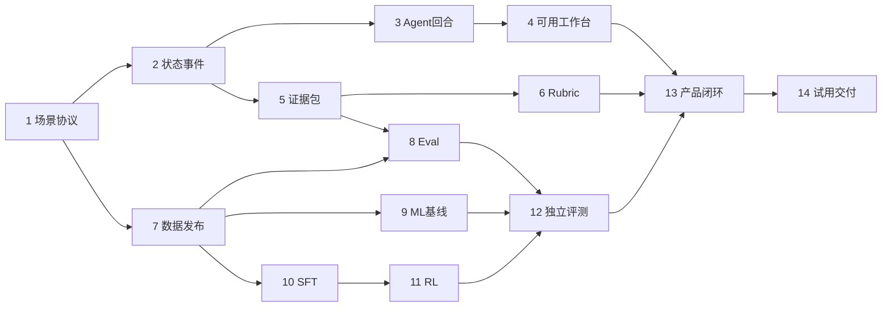

# 职业任务训练场 Implementation Plan

> **For agentic workers:** REQUIRED SUB-SKILL: Use superpowers:subagent-driven-development (recommended) or superpowers:executing-plans to implement this plan task-by-task. Steps use checkbox (`- [ ]`) syntax for tracking.

**Goal:** 实现可实际试用的 AI PM 职业任务训练场，完成有证据的评价、可复现的 Eval，以及同底座 SFT 与 GRPO 的真实实验。

**Architecture:** 以场景引擎保存权威状态，角色 Agent 通过带权限和版本的工具交互。Judge 根据材料、操作和交付评价原子 rubric，训练用 gold 与产品模型输入隔离；Eval runner 负责独立检验环境、Judge 和产品表现。

**Tech Stack:** React/TypeScript、FastAPI/Pydantic、PostgreSQL、Python worker、scikit-learn、PyTorch/Transformers、TRL/PEFT；候选版本在冒烟测试后锁定。

**Spec:** [职业任务训练场技术设计](../design/career-training-technical-design.md)。执行者先阅读该文档；本计划不授权自动开始产品开发、租卡、下载大型数据或向外部发布。

**2026-10-03 实施更新：** 用户已授权依次完成当前可执行的非前端、非后训练工作。Task 1–9 后端工程/pilot、Task 12注册、Task 13后端及Task 14自动验证已完成；人工验收、正式实验和课程交付仍待做。逐项结果见[实施进度](../reports/implementation-progress.md)和[最终工程报告](../reports/final-results.md)。混合包含人工、前端或Git提交的原条目保留未勾选，下方实施状态说明已实现部分。

## Global Constraints

- 首版只有一个岗位、一个核心任务族、三个主要角色；先交付主任务和两个可体验变体。
- 产品主语言和领域测试为中文，公开英语数据单独标记，不冒充中文人类 gold。
- 权威事实来自场景状态；角色回复不能直接改写世界。
- `gold` 不进入模型 prompt、角色工具、前端、检索索引；prompt 白名单必须自动测试。
- split 按 template/root group 隔离；所有派生记录继承分区；不得按 JSONL 行随机拆分。
- relation 标签为 `SUPPORTED / CONTRADICTED / INSUFFICIENT`；criterion 标签为 `MET / PARTIAL / NOT_MET / INSUFFICIENT / NOT_APPLICABLE`。
- INSUFFICIENT 与模型 abstain/review 分开；记录缺失不自动扣分。
- 场景、数据、rubric、模型、prompt、reward、grader 均有不可变版本和 hash。
- 比较 Base/SFT/RL 时固定底座、输入与推理预算，额外报告资源开销；不承诺 RL 一定更好。
- 单卡训练与在线演示分时；实际卡型、显存、API 与租卡预算在对应任务中确认。
- 只将测试通过且已实际运行的模块记为完成；文档、命令和期望输出本身不是执行证据。

## Review Focus

1. 用户在事件发生前的判断不能因未来信息被扣分：Task 2、5、6 验证 as-of 版本与可见性。
2. 同一请求被浏览器/worker 重发不能重复耗费业务资源：Task 2、3、13 验证幂等与恢复。
3. 合理替代方案不能因不匹配参考文案被判失败：Task 1、6、8 使用多组证据和替代路径测试。
4. 评分模型不能看到 gold 或跨 split 派生内容：Task 5、7、9、11 验证 prompt 和 lineage。
5. 训练 reward 上升但产品错误扣分增加不能被当作成功：Task 8、11、12、14 保存独立指标与候选对比。

## 使用方式与阶段边界

本计划分为四个可独立交付的工作流：A 产品与环境、B 数据与评价、C 模型与 RL、D 集成与验证。每个任务有明确接口和可验证产物；负责人可以用固定夹具开发，不必等待所有上游模型。

编写计划时目录只有课程资料。2026-10-02 已新增 Task 1 代码、场景、测试与运行说明，目录仍未初始化 Git，尚无代码提交。后续选定仓库后按已验收模块提交。未执行任务的文件、命令与测试仍是目标。

## 项目文件结构

```text
apps/web/src/
  features/session/       # 任务、材料与对话
  features/workbench/     # 配置、知识助手测试与交付
  features/feedback/      # 证据反馈与补练
  api/                   # 类型化 HTTP 客户端
src/career_lab/
  contracts/             # 公共 Pydantic 输入输出类型
  scenarios/             # 场景加载、状态 reducer、可见视图
  runtime/               # 模型适配、回合循环、工具路由、恢复
  tools/                 # 材料、测试、配置与交付工具
  assistant/             # 可测试的知识助手
  storage/               # SQL、内容寻址文件和迁移
  jobs/                  # 后台任务 lease 与 worker
  api/                   # FastAPI 路由
  evidence/              # claim、证据组装、权限与时间过滤
  rubrics/               # 原子项、规则、聚合与补练
  datasets/              # 导入、合成、标注、split、manifest
  evals/                 # runner、grader、metrics、diff、report
  models/                # 线性、编码器、生成式 Judge、ensemble
  training/              # SFT、reward、GRPO adapter、checkpoint
  registry/              # 模型状态、候选选择与回退
scenarios/pm_pilot/      # 版本化事实、材料、事件和规则
configs/                # 默认配置与实验配置，不保存密钥
data/releases/          # 发布数据与 gold，不默认提交个人数据
runs/                   # 运行 manifest、预测、指标与checkpoint引用
tests/unit/
tests/integration/
tests/e2e/
docs/
```

建议提供一个项目 CLI：`python -m career_lab.cli <command>`。CLI 的 `--help`、真实参数和退出码是交付的一部分，不在不同脚本里维护互不兼容的命名。

## 公共类型与服务接口

在 Task 1 定义并固定以下类型。这里是接口规格，执行时使用 Pydantic models，不要求原样复制为代码。

| 类型 | 必需内容 |
|---|---|
| ScenarioSpec | id, version, family_id, template_id, facts, roles, materials, event_rules, constraints |
| WorldState | session_id, version:int, logical_time, resources, configs, material_versions |
| Action | id, idempotency_key, expected_version:int, actor_id, tool, arguments |
| TransitionResult | state:WorldState, events:list[Event], replayed:bool |
| RoleView | role_id, state_version, permitted_facts, permitted_materials, recent_events |
| ToolResult | status, data, evidence_refs, state_version, error_code |
| EvidencePackage | item_id, task_type, criterion, claim, as_of_seq, candidate_evidence, completeness, input_hash |
| GoldAnnotation | item_id, label, label_tier, acceptable_evidence_sets, missing_requirement, annotation_version |
| JudgeDecision | label, evidence_ids, reason_code, explanation, model_revision |
| ItemGrade | item_id, schema_valid, label_correct, evidence_score, joint_correct, error_class |
| RewardBreakdown | total, format_valid, label_correct, evidence_valid, evidence_score, reward_version |
| EvalConfig | suite, dataset_manifest, candidate, prompt_version, input_mode, decode, seeds, concurrency |
| RunReport | run_id, manifest_path, metrics, slices, paired_diff_path, errors_path |

`EvidencePackage` 中不能有 gold_ref、label、acceptable_evidence_sets。数据仓库样本可以有这些 metadata，但 prompt serializer 只接受 EvidencePackage，降低误传风险。

## 工作流 A 产品与环境

### Task 1 定义可完成的场景和公共协议

**Files:**
- Create: `src/career_lab/contracts/scenario.py`, `actions.py`, `evaluation.py`
- Create: `scenarios/pm_pilot/v1/scenario.yaml`, `materials/*.md`, `rubric.yaml`
- Test: `tests/unit/test_scenario_contract.py`, `test_solution_paths.py`

**Interfaces:**
- Consumes: 技术设计第 3、5、11 节；[评价样例包](../examples/judge-case-bundle.json)。
- Produces: `load_scenario(path: Path) -> ScenarioSpec`；`validate_scenario(spec: ScenarioSpec) -> list[ValidationIssue]`。

- [x] 写测试 `test_capacity_and_exception_are_explicit`：容量=30，开发资源=3，批准扩容作为独立事件。
- [x] 写测试 `test_two_valid_solution_paths`：限定稳定知识域和获得资源后延后开放均可满足约束；“全部拒绝”不自动达标。
- [x] 运行 `pytest tests/unit/test_scenario_contract.py tests/unit/test_solution_paths.py -q`，确认缺失 loader/定义时失败。
- [x] 实现 Pydantic 类型、加载器与场景；所有引用材料都存在，事件触发和后果明确。
- [x] 再运行上述测试，按材料走读任务，确认必要信息可获得且至少一个方案可完成。此项不是用户试用。
- [x] 保存场景版本、manifest与实际测试结果，见实施记录。
- [ ] 提交该任务的文件：当前尚无 Git 仓库，未创建提交。

**产物：**可加载、可解的场景与协议。尚不依赖模型。

### Task 2 实现状态转换与事件存储

**2026-10-02 实施状态：代码与本机数据库验证完成。** 全量29 tests通过，包含真实PostgreSQL持久化恢复；报告task-02-tests.xml。schema 001，SQLite支持离线测试，PostgreSQL使用55439端口。历史视图从指定快照生成；事件、状态、幂等结果同事务。未做Git提交。


**Files:**
- Create: `src/career_lab/scenarios/reducer.py`, `visibility.py`
- Create: `src/career_lab/storage/events.py`, `sessions.py`, `migrations/001_sessions.sql`
- Test: `tests/unit/test_reducer.py`, `tests/integration/test_action_idempotency.py`

**Interfaces:**
- Consumes: ScenarioSpec, WorldState, Action。
- Produces: `apply_action(state: WorldState, action: Action, spec: ScenarioSpec) -> TransitionResult`；`project_view(state: WorldState, actor_id: str, as_of_seq: int) -> RoleView`；`commit_action(session_id: str, action: Action) -> TransitionResult`。

- [x] 写测试：重复同一 idempotency_key 得到同一结果，event 数不增加；错误 expected_version 返回冲突。
- [x] 写测试：seq=5 的视图看不到 seq=10 的材料更新；技术负责人私有事实不会出现在业务负责人视图。
- [x] 运行 `pytest tests/unit/test_reducer.py tests/integration/test_action_idempotency.py -q`，确认失败。
- [x] 实现纯 reducer 与事务存储；快照和事件同事务，角色视图服务端过滤。
- [x] 测试全部通过，增加一次数据库重启后的状态恢复验证。
- [ ] 提交并记录 schema 迁移版本。

**产物：**无 LLM 的可恢复任务环境。

### Task 3 实现角色 Agent 回合和后台 jobs

**2026-10-02 实施状态：代码与真实模型联调完成。** 全量33 tests通过；DeepSeek deepseek-chat真实回合2轮，含read_material工具反馈，结果见task-03-live-model.json。任务支持lease/heartbeat/retry与过期worker fencing；API调用不是exactly-once，本地回合提交幂等。默认本地模式明确标注。


**Files:**
- Create: `src/career_lab/runtime/model_adapter.py`, `loop.py`, `tool_router.py`
- Create: `src/career_lab/jobs/worker.py`, `repository.py`
- Test: `tests/unit/test_agent_loop.py`, `tests/integration/test_job_recovery.py`

**Interfaces:**
- Consumes: RoleView, ToolResult；Task 2 的 commit_action。
- Produces: `run_turn(session_id: str, role_id: str, text: str, request_id: str) -> TurnResult`；`execute_tool(ctx: ToolContext, call: ToolCall) -> ToolResult`；`claim_job(worker_id: str) -> Job | None`。

- [x] 用 scripted model 写测试：工具结果必须回填下一轮，超过 3 次工具循环停止；最终回复没有被执行的操作不能变成事件。
- [x] 写恢复测试：worker 在模型返回后、业务提交前退出，重试不重复提交；API 成本可能重复但 trace 可查。
- [x] 运行 `pytest tests/unit/test_agent_loop.py tests/integration/test_job_recovery.py -q`，确认失败。
- [x] 实现显式循环、模型 adapter、tool allowlist、lease/heartbeat；固定调用与超时上限为配置。
- [x] 执行测试后，用一个真实模型请求验证 adapter；只证明接口工作，不宣称事实可靠性。
- [ ] 提交，保存一次真实 turn 的去敏 trace。

**产物：**有状态、有工具反馈、有恢复的角色交互。

### Task 4 做出用户可操作的知识助手与提交路径

**2026-10-02 实施状态：后端代码与API流程验证完成。** 全量35 tests通过。真实BM25文本检索、可替换生成接口、源/索引/配置版本、成果及不可变提交、会话令牌鉴权已实现；API重启恢复通过。UI按用户要求排除，非实现者试用与演示录屏未完成。


**Files:**
- Create: `src/career_lab/assistant/retrieval.py`, `service.py`
- Create: `src/career_lab/tools/materials.py`, `testing.py`, `pilot.py`, `submission.py`
- Create: `src/career_lab/api/sessions.py`, `actions.py`, `submissions.py`
- Create: `apps/web/src/features/session/*`, `apps/web/src/features/workbench/*`
- Test: `tests/integration/test_assistant_versions.py`, `tests/e2e/test_session_submission.py`

**Interfaces:**
- Consumes: 场景材料和状态。
- Produces: `run_assistant_test(session_id: str, query: str, config_version: int) -> TestRun`；`submit_plan(session_id: str, artifact_version: int, config_version: int) -> Submission`。

- [x] 写测试：源文档更新而索引未更新时，test record 保存两种版本；更新配置后行为变化有记录。
- [ ] 写端到端测试：创建任务→阅读→向角色提问→测试→改配置→提交；刷新页面后内容仍存在。
- [x] 运行 `pytest tests/integration/test_assistant_versions.py tests/e2e/test_session_submission.py -q`，确认失败。
- [ ] 实现真实文本检索、可替换生成、结构化表单和最小 UI；固定夹具只用于测试。
- [ ] 跑通真实短任务，由一位非实现者试用并记录卡点。
- [ ] 提交，保留一个演示录屏和未接模型反馈时的人工反馈示例。

**产物：**第一个可用产品切片。此时模型训练尚未完成也能试用。

## 工作流 B 数据与评价

### Task 5 构建证据包与输入隔离

**2026-10-02 实施状态：输入隔离与组装代码验证完成。** 全量38 tests通过。按submission时点与learner权限构建oracle/retrieved输入、中性引用及来源映射；input_hash白名单校验；溢出显式overflow，检索模式保守标记missing。10份真人/人工成果核验未执行，当前为工程验收。


**Files:**
- Create: `src/career_lab/evidence/assembler.py`, `serializer.py`, `retriever.py`
- Test: `tests/unit/test_evidence_assembly.py`, `test_prompt_leakage.py`

**Interfaces:**
- Consumes: Submission, Event, EvidenceRef, CriterionSpec。
- Produces: `assemble_item(submission_id: str, criterion_id: str, mode: str) -> EvidencePackage`；`serialize_prompt(item: EvidencePackage) -> list[ChatMessage]`。

- [x] 写测试：未来版本、无权材料与 gold 字段不能进入 prompt；更改 gold 不改变 input_hash。
- [x] 写测试：材料溢出返回明确 completeness/overflow 状态，不悄悄截断后判用户错。
- [x] 运行 `pytest tests/unit/test_evidence_assembly.py tests/unit/test_prompt_leakage.py -q`，确认失败。
- [x] 实现 oracle/retrieved 双模式、token 预算和中性 evidence IDs，保留完整来源映射。
- [ ] 通过测试，并对 10 个真实/手写成果人工检查组装材料是否充分。
- [ ] 提交并冻结 input contract v1。

**产物：**训练、产品、评测共用的安全且可解释输入层。

### Task 6 实现 Rubric 规则和反馈聚合

**2026-10-02 实施状态：规则与反馈聚合代码验证完成。** 全量47 tests通过；容量批准例外、资源约束、三正三反、未知分数上下界与coverage、全部不适用均验证。开放语义项保留待核验，不冒充完整Judge。规则版本rules-v1，场景rubric未修改。


**Files:**
- Create: `src/career_lab/rubrics/loader.py`, `checks.py`, `aggregate.py`, `feedback.py`, `practice_map.py`
- Test: `tests/unit/test_rubric_rules.py`, `test_score_bounds.py`

**Interfaces:**
- Consumes: EvidencePackage, JudgeDecision, CriterionSpec。
- Produces: `run_rule_checks(item: EvidencePackage) -> list[RuleCheck]`；`aggregate_items(items: list[CriterionResult], rubric: RubricSpec) -> FeedbackReport`。

- [x] 写测试：MET=2、PARTIAL=1、NOT_MET=0；一个已得 2 分项加一个未知项时，维度区间为 [0.5,1.0]，coverage=0.5。
- [x] 写测试：NOT_APPLICABLE 排除；缺日志与明确未提交区别；已有扩容批准不能按旧人数上限扣分。
- [x] 运行 `pytest tests/unit/test_rubric_rules.py tests/unit/test_score_bounds.py -q`，确认失败。
- [x] 实现规则、维度区间、证据反馈模板与补练映射，开放判断保留待核验状态。
- [x] 增加全不适用的输入测试，预期 unscorable 而不是满分或除零错误。
- [x] 使用三条合理方案和三条明确错误方案检查误伤与漏报。
- [ ] 提交；rubric 修改保留版本与变更原因。

**产物：**即使无生成式 Judge，用户也能获得局部有效反馈。

### Task 7 发布数据集 v1

**2026-10-02 实施状态：数据管线与pilot发布验证完成，人工验收待完成。** 全量52 tests通过。已生成90条中文G0试运行样本（6因果模板，45/30/15分区）并审计；真实下载ContractNLI，导入5份原始train合同共85项，保留span偏移与原标签，来源hash/许可证见task-07-public-source.json。真实数据发现空白span，已回归修复以保留原文。未冒称双标或正式800–1500条研究发布。


**Files:**
- Create: `src/career_lab/datasets/sources.py`, `import_contractnli.py`, `generate.py`, `annotate.py`, `split.py`, `audit.py`
- Optional: `src/career_lab/datasets/import_fever.py`，首个来源跑通后再做。
- Create: `configs/data_v1.yaml`, `data/releases/v1/*`
- Test: `tests/unit/test_data_lineage.py`, `test_public_import.py`

**Interfaces:**
- Consumes: source registry、场景账本、人工标注。
- Produces: `build_release(config: DataBuildConfig) -> DatasetManifest`；`audit_release(manifest: Path) -> AuditReport`。

- [x] 写测试：父样本及改写/译文/正负对必须同 split；不同 split 中相同模板直接失败。
- [x] 写测试：ContractNLI 原文 span 偏移与标签映射正确；源测试不能拼回 train；gold 不进入 test.inputs；原 span 列表不能自动当唯一最小充分集合。
- [x] 运行 `pytest tests/unit/test_data_lineage.py tests/unit/test_public_import.py -q`，确认失败。
- [ ] 先导入/构建 60–100 条，完成双标试验，记录分歧与每条耗时。
- [ ] 修正标注手册，再扩至资源允许的 v1；运行 `python -m career_lab.cli data audit --manifest data/releases/v1/manifest.json`。
- [x] 预期：退出码 0，报告给出样本/模板/标签/语言数、无已知 group 泄漏；发布 data card 与 hash。
- [ ] 提交生成器、规范与可再分发 manifest；个人数据及受限数据不默认提交仓库。

**产物：**可以真正供训练和独立评测使用的数据，不只是生成 prompt。

### Task 8 实现 Eval runner 与报告

**2026-10-02 实施状态：Eval基础设施与双候选冒烟完成。** 全量55 tests通过；30项dev数据上常量候选accuracy=1/3、故障候选30个infrastructure errors且端到端准确率0；断点恢复不重复调用、replicate新建试次、引用充分性与多组证据验证通过。已生成manifest/predictions/metrics/errors/report与paired diff，group bootstrap按模板；测试分区未运行。


**Files:**
- Create: `src/career_lab/evals/runner.py`, `graders.py`, `metrics.py`, `slices.py`, `report.py`
- Create: `configs/eval_smoke.yaml`
- Test: `tests/unit/test_graders.py`, `test_metrics.py`, `tests/integration/test_eval_resume.py`

**Interfaces:**
- Consumes: EvalConfig, EvidencePackage, GoldAnnotation, CandidateAdapter。
- Produces: `grade_decision(decision: JudgeDecision, gold: GoldAnnotation, item: EvidencePackage) -> ItemGrade`；`run_eval(config: EvalConfig) -> RunReport`。

- [x] 写测试：不存在引用、正确标签但不充分证据、多组有效证据、模型格式错误各自分类正确。
- [x] 写指标测试：gold MET 被判 NOT_MET 计 false deduction；接口故障单列但端到端失败保留。
- [x] 写 resume 测试：已完成 trial 不重跑，replicate_id 创建新尝试，缓存不跨权限或版本。
- [x] 运行 `pytest tests/unit/test_graders.py tests/unit/test_metrics.py tests/integration/test_eval_resume.py -q`，确认失败。
- [x] 实现 runner、JSONL 结果、paired diff、group bootstrap 与 Markdown 报告。
- [x] 运行 `python -m career_lab.cli eval run --config configs/eval_smoke.yaml`，预期 manifest/predictions/metrics/report 全部存在且可解释每个失败。
- [ ] 提交，用两个 scripted candidates 验证报告确实区分质量与系统故障。

**产物：**可复现的 Judge 与环境评测基础设施。

## 工作流 C 模型与 RL

### Task 9 训练监督基线和课程集成模型

**2026-10-03 实施状态：CPU监督基线与E1开发集实验完成。** 全量57 tests通过；实际训练TF-IDF Logistic、字符n-gram MLP(32,16)和概率融合，非预训练Transformer/非SFT。dev Macro-F1分别0.7661/0.6667/0.7661，选alpha=0，融合无增益；保存权重hash、训练输入ID和独立Eval报告task-09-e1-dev.json。正式大样本复核待数据人工验收，test未用于选型。


**Files:**
- Create: `src/career_lab/models/linear.py`, `encoder.py`, `ensemble.py`, `adapter.py`
- Create: `configs/linear_v1.yaml`, `encoder_v1.yaml`, `ensemble_v1.yaml`
- Test: `tests/unit/test_model_contracts.py`, `test_ensemble.py`

**Interfaces:**
- Consumes: DatasetManifest。
- Produces: `fit_linear(config: TrainConfig) -> ModelArtifact`；`fit_encoder(config: TrainConfig) -> ModelArtifact`；`predict_proba(items: list[EvidencePackage]) -> ProbabilityBatch`。

- [x] 写测试：概率列顺序固定为三种 relation 标签，总和近似 1；训练预处理不能拟合 dev/test。
- [x] 写融合测试：alpha=0 与线性一致，alpha=1 与编码器一致，alpha 只由 dev 选择。
- [x] 运行 `pytest tests/unit/test_model_contracts.py tests/unit/test_ensemble.py -q`，确认失败。
- [ ] 实现并先在小子集训练，检查标签映射、过拟合小样本和候选证据截断。
- [x] 在 v1 train/dev 训练与选权重，通过 Task 8 输出 E1 报告；test 留待冻结。
- [ ] 提交配置和报告，模型权重注册引用，不把二进制塞入普通 Git。

**产物：**课程监督学习、DL、ensemble 的可核验实验基础。

### Task 10 完成生成式 Judge 的 SFT

**2026-10-03 实施状态：本轮排除。** 用户明确排除后训练；未进行SFT、下载底座或GPU训练。


**Files:**
- Create: `src/career_lab/training/sft.py`, `formatting.py`, `checkpoint.py`
- Create: `src/career_lab/models/generative.py`
- Create: `configs/sft_v1.yaml`
- Test: `tests/unit/test_sft_format.py`, `tests/integration/test_sft_smoke.py`

**Interfaces:**
- Consumes: EvidencePackage 与训练 gold，Qwen 模型 revision。
- Produces: `build_sft_record(item: EvidencePackage, gold: GoldAnnotation) -> SFTRecord`；`train_sft(config: SFTConfig) -> ModelArtifact`；`judge(item: EvidencePackage, model: ModelRef) -> JudgeDecision`。

- [ ] 写测试：gold 只出现在 assistant target，prompt 不含标签；completion mask 不训练用户材料。
- [ ] 运行 `pytest tests/unit/test_sft_format.py -q`，确认失败后实现格式化与 trainer adapter。
- [ ] 在 Linux GPU 环境执行 20-step smoke，记录依赖、峰值显存、step time、样本输出，锁定环境。
- [ ] 验证至少一个 adapter tensor 发生变化，保存/加载后输出协议一致；命令成功但权重未变不能通过。
- [ ] 训练 v1、在 dev 选 checkpoint，通过 runner 比较 Base/SFT。
- [ ] 提交配置、依赖锁和模型卡；标注未做最终测试。

**产物：**可供产品和 RL 使用的真实 SFT checkpoint。

### Task 11 实现奖励与 GRPO

**2026-10-03 实施状态：本轮排除。** 用户明确排除后训练；未进行GRPO、奖励训练或continued-SFT。


**Files:**
- Create: `src/career_lab/training/reward.py`, `grpo.py`, `rollouts.py`, `config_validation.py`
- Create: `configs/grpo_v1.yaml`
- Test: `tests/unit/test_reward.py`, `test_reference_policy.py`, `tests/integration/test_grpo_smoke.py`

**Interfaces:**
- Consumes: 固定 SFT artifact、训练 EvidencePackage/GoldAnnotation、reward v0。
- Produces: `compute_reward(raw_output: str, item: EvidencePackage, gold: GoldAnnotation) -> RewardBreakdown`；`train_grpo(config: GRPOTrainConfig) -> ModelArtifact`。

- [ ] 用 [样例包](../examples/judge-case-bundle.json) 写 reward 测试：正确且充分=1；正确但只命中部分必要证据=0.7；正确且多引一个无关证据=0.9；错误标签=-0.5；无效引用或 JSON=-1。
- [ ] 写测试：INSUFFICIENT 按缺失条件处理；不能总给空引用加分；重复 evidence ID 视为格式错误。
- [ ] 写 reference 测试：KL 参考实际加载冻结 SFT，不能意外退回原 base；trainer 不能读 test gold。
- [ ] 运行 `pytest tests/unit/test_reward.py tests/unit/test_reference_policy.py -q`，确认失败，再实现 reward 与 config validation。
- [ ] 运行 20-step GPU smoke，验证 batch/G 整除、奖励分项、参数更新、截断与保存恢复。
- [ ] 以 G=4、显式 loss/beta 配置试跑，记录所有 rollout 和零方差组比例；若不可承受则按技术设计调整并另建 run。
- [ ] 训练候选，同时运行 continued-SFT 对照；通过 dev 比较准确性、joint correctness、false deduction 与成本。
- [ ] 提交配置、reward 版本、训练日志与负结果，未经验证不替换产品模型。

**产物：**真正的 RL 更新与可追溯 reward，不是只写一段奖励代码。

### Task 12 完成独立评测与候选注册

**2026-10-03 实施状态：候选注册代码完成，后训练对照与确认性测试待做。** 全量59 tests通过；3个真实CPU模型与dev报告已注册，绑定模型/数据/rubric/报告hash；篡改失效、缺指标拒绝注册。全部标记relation_eval_only且不允许替代产品criterion Judge；没有SFT/RL候选或独立test结论。


**Files:**
- Create: `src/career_lab/registry/models.py`, `selection.py`
- Create: `configs/eval_confirmatory_v1.yaml`
- Test: `tests/unit/test_candidate_selection.py`

**Interfaces:**
- Consumes: Base/SFT/RL/continued-SFT artifacts、统一 rubric/grader 与冻结测试 manifest。
- Produces: `register_candidate(model: ModelArtifact, report: RunReport) -> ModelRef`；`select_deployment(candidates: list[CandidateRecord], decision: SelectionDecision) -> ModelRef`。

- [x] 写测试：模型或 rubric hash 改变导致历史报告失效；缺主指标或错误数据版本不能标记为已验证。
- [ ] 写测试：RL 训练 reward 高但独立错误扣分恶化时，选择结果仍可保持 SFT，且报告保留 RL。
- [ ] 运行 `pytest tests/unit/test_candidate_selection.py -q`，确认失败，再实现注册和人工决策记录。
- [ ] 冻结 prompt、奖励、checkpoint、decode 和主指标，执行一次 confirmatory test。
- [ ] 保存按 group 的差异与置信区间、失败切片、全部成本；若据此修改模型，标记测试已用于开发，不继续称独立。
- [ ] 提交模型卡、局限和候选选择理由。

**产物：**可以被产品采用的版本化 Judge，以及诚实的 SFT/RL 对照结论。

## 工作流 D 集成与验证

### Task 13 接入反馈与过程回放

**2026-10-03 实施状态：反馈任务与回放后端验证完成。** 全量60 tests通过；后台反馈job、固定submission/rubric/rules-v1、原版本证据链接、回放不调用模型且不追加业务事件、刷新重取结果通过。前端排除；主任务及两变体整体验证随Task 14演示执行。


**Files:**
- Create: `src/career_lab/api/feedback.py`, `timeline.py`
- Create: `apps/web/src/features/feedback/*`
- Test: `tests/e2e/test_feedback_replay.py`, `tests/integration/test_model_version_pin.py`

**Interfaces:**
- Consumes: 注册模型、EvidencePackage、FeedbackReport、历史 events。
- Produces: 用户可用的证据反馈、补练入口、时间线、暂停恢复。

- [x] 写测试：反馈证据链接可打开原版本；新模型发布不修改旧反馈；未完成反馈 job 刷新后可继续。
- [x] 写测试：回放不新增模型调用或业务事件；系统缺材料显示待核验而非错误扣分。
- [ ] 运行 `pytest tests/e2e/test_feedback_replay.py tests/integration/test_model_version_pin.py -q`，确认失败。
- [ ] 实现 UI、API、版本 pin 与模型 fallback 标识；如生成解释失败，显示模板反馈。
- [x] 跑通完整主任务和两个变体，包括一次事件变化与一次进程重启。
- [ ] 提交，并保存脱敏端到端 trace。

**产物：**用户任务、评价、反馈和下一次练习的完整产品路径。

### Task 14 试用与课程最终交付

**2026-10-03 实施状态：可自动执行的后端交付完成，人工与课程材料待做。** 全量67 tests通过（含真实PostgreSQL）；主任务和两个变体均submitted且重开回放一致；真实DeepSeek HTTP/独立worker完成；实际PostgreSQL容器重启恢复通过。源代码包在独立解压目录uv sync后66 tests通过、1项PG跳过，并完成demo、数据重建/审计、CPU训练和eval smoke；见task-14-clean-install.json。首次干净安装暴露pytest父目录缺失，已修复并从新目录重验。前端、真人试用、正式双标、slides/视频/个人报告未冒称完成。


**Files:**
- Create: `docs/user-study/protocol.md`, `docs/reports/final-results.md`, `README.md`
- Create: `configs/demo.yaml`, `scripts/package_release.py`
- Test: `tests/e2e/test_clean_install_demo.py`

**Interfaces:**
- Consumes: 可运行产品、数据/model manifest、评测报告。
- Produces: 真实试用记录、可复现发布包、课程材料和个人贡献证据。

- [ ] 先找少量用户试用，记录卡点、错误反馈与人工帮助，修复核心流程。
- [ ] 如有资源，执行新任务无提示的探索性对照；人工评价不看模型或组别。
- [x] 编写干净环境复现测试：加载场景→演示任务→加载 Judge→运行 eval smoke→生成报告。
- [x] 在新环境运行 `pytest tests/e2e/test_clean_install_demo.py -q`；下载与 API 需求在 README 明确。
- [x] 打包可分发代码、数据/获取脚本、模型/adapter、结果与运行说明；排除凭据、个人原始日志和无权再分发数据。
- [ ] 完成最终报告、两次 slides、10–15 分钟视频、个人报告及 peer review。
- [x] 核对归档内容与课程要求，记录未完成扩展与结果局限。

**产物：**可运行、可复验、可演示的课程项目。

## 依赖与可并行工作



Task 13 早期可以用规则或 SFT stub 开发，不必等 Task 12；图中依赖表示正式接入版本的条件。数据冻结与训练不阻止前端推进。

## 完成记录模板

每个任务完成后填入：负责人、代码/配置版本、执行命令、实际结果、报告路径、已知限制、下一项消费者。不得把文档里的“预期 PASS”复制成实测结果。

| Task | 状态 | 负责人 | 实际验证记录 |
|---|---|---|---|
| 1 | 代码与场景已实现；待Git归档 | Codex，用户发起 | [实施与验证记录](../reports/task-01-implementation.md) |
| 2–9 | 后端工程与pilot完成，人工验收另列 | Codex，用户授权 | 各Task状态及reports/task-02至09证据 |
| 10–11 | 本轮排除后训练 | — | 未执行SFT/GRPO |
| 12 | 候选注册完成；正式对照待做 | Codex | task-12-tests.xml；model-card-pilot.md |
| 13 | 后端完成；前端排除 | Codex | task-13-tests.xml及最终回归 |
| 14 | 自动交付完成；真人/课程材料待做 | Codex | task-14-tests.xml、task-14-clean-install.json |

## 本计划自检结果

- 课程三个主要技术类别分别落在 Task 7、9、10；RL 扩展落在 Task 11，不能替代 ensemble 实验。
- 原子 rubric、用户评分、Judge eval、RL reward 分别在 Task 6、8、11 明确。
- 信息时间、幂等恢复、合理替代方案、gold 隔离、独立测试均有归属测试。
- 尚未决定的硬件预算和实际依赖由 Task 10 冒烟测试测定，不阻止 Task 1–9。
- 已完成上述本轮后端范围和CPU监督pilot；没有后训练、Git提交或用户效果证明。
