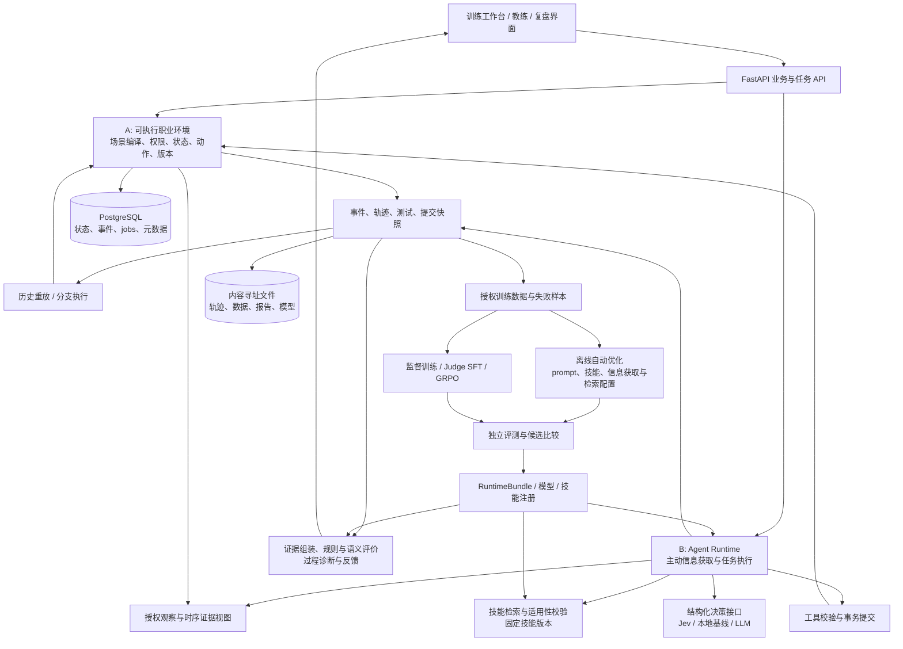

# RoleCraft 最终目标技术框架与详细设计

版本：2.0　日期：2026-10-04　文档类型：目标架构定稿

本稿依据本轮讨论，将 A「可执行训练与过程复盘」和 B「主动信息获取、技能记忆、自动优化」确认为并重的两条主线，并正式纳入 Jev 结构化决策适配器。本文描述最终应具备的能力、模块契约、实验和可验证边界，不代表这些能力已经实现。

本文不安排实施阶段、排期、工时、任务负责人或迁移步骤；从当前版本到目标架构的建设路线另行讨论。旧技术设计保留为历史记录；若目标范围发生冲突，以本稿为准，当前实现状态仍以源码和验收报告为准。

阅读导航：[总体架构](#4-总体架构) · [环境与场景](#5-a可执行场景与业务环境) · [主动信息获取](#7-b1主动信息获取与-agent-runtime) · [Jev](#9-jev结构化判断组件) · [技能记忆](#10-b2版本化技能记忆) · [自动优化](#11-b3离线自动优化) · [实验矩阵](#14-数据谱系与评测实验) · [当前基础对照](#19-当前基础与目标能力对照)

## 1. 核心决策

**产品定位：面向 AI 产品经理的职业任务训练环境，支持有状态执行、证据化过程复盘，以及具备主动信息获取、可复用技能和持续优化能力的 Agent。**

用户在模拟公司中完成企业知识助手试点任务：咨询角色、查阅材料、识别变化、运行测试、申请资源、调整方案、提交成果并补练。用户最终得到可执行的方案和能够定位到具体行为、材料版本的反馈。

| 决策 | 最终采用的方式 |
|---|---|
| A 与 B 的关系 | A 提供环境、执行结果与验证器；B 在相同环境中决策并积累经验；二者共享协议和轨迹，保持模块独立 |
| B 的三个组成 | 主动信息获取负责回合内决策；技能记忆负责跨任务经验；自动优化负责离线版本搜索，均为正式目标能力 |
| Jev 的角色 | 在证据判断、候选行动排序、技能适用性和复核路由中提供结构化判断；通过独立接口接入 |
| 状态权威 | 场景引擎及其事务存储；模型返回建议，工具执行服务负责校验与提交 |
| 反馈机制 | 确定性规则、语义模型、证据校验和过程诊断协作；保存不确定项及其原因 |
| 模型学习 | 保留监督基线，建立证据选择与语义 Judge 的 SFT/GRPO 研究接口及对照；产品采用通过验证的候选 |
| 多智能体 | 模块拆分不自动等于多智能体；独立 Agent 团队是可选实验拓扑，核心架构不依赖它 |
| 自我改进 | 自动改进 prompt、技能、检索及信息获取配置；代码级递归自我修改属于扩展，不纳入本版核心承诺 |
| 部署 | 单机模块化服务、API 与持久化 worker 分离；GPU 训练独立运行，不要求分布式平台 |

设计成功以任务完成、反馈正确、变化处理、经验迁移和可复现改善为依据。模型数量、调用次数和技术名词数量不作为成功指标。

## 2. 产品使用方式与成功标准

### 2.1 四种使用模式

| 模式 | 谁执行任务 | B 提供的能力 | 结果使用方式 |
|---|---|---|---|
| learner | 真人 | 默认独立操作；用户请求帮助时记录辅助段落并切换相应提示模式 | 职业训练、提交和复盘 |
| coached | 真人与教练 | 按提示策略指出缺失证据、推荐测试、解释适用技能，记录帮助次数 | 辅助训练；与无提示表现分开报告 |
| agent-benchmark | 参考 Agent | 自主查询、测试、配置、申请、提交 | 测试环境、策略、记忆和模型能力 |
| branch-review | 真人或参考 Agent | 从固定历史状态执行备选行动 | 对比方案、诊断问题、产生候选训练样本 |

真人操作界面和参考 Agent 使用同一套业务动作与授权规则。教练上下文只能读取用户当前被允许获知的信息；研究验证器可访问隐藏真值，但不能把真值经提示或工具响应泄露给参与者。

### 2.2 功能成功、研究成功与局部依赖

- 功能成功：能完成一次有明确目标的任务；成果、测试与提交版本一致；反馈引用可打开；分支不改变原会话。
- Agent 成功：终态满足场景目标，必要操作确实执行；成本、延迟、无效查询及帮助使用被记录。
- 研究成功：在未参与选型的数据上报告模块贡献、负结果和不确定性；改善可以来自检索、记忆或训练，不预设哪一种获胜。
- 核心运行条件：可解场景、合法工具、身份与状态一致、可保存提交、最小规则反馈和可恢复任务。
- 人工语义验证约束语义评分的正式采用；训练资源约束后训练实验；这些条件不阻止独立的界面、环境、记忆或回放能力工作。
- 真人学习效果需要新任务上的真实表现记录；Agent 改善、合成成绩和满意度不能替代这一结论。

## 3. 课程与技术能力映射

课程文件要求在四个方向中至少覆盖三个。前三类作为明确交付主轴，第四类围绕业务态势理解展开，其课程归类以教师口径为准。[课程文件第 9 页](../../../For%20FT%20students%20only%20%28excluding%20Aramco%20students%29/PRS-PatternRecognitionSystems-Practice-Module%207.0%20-%20FT.pdf)

| 方向 | 具体任务 | 方法 | 必须呈现的证据 |
|---|---|---|---|
| Supervised Learning | 判断—证据关系、证据选择、原子评分项、过程错误分类 | 有标注训练、按场景谱系划分 | 数据卡、标签来源、划分、类别指标、失败案例 |
| ML / DL | 比较轻量分类器与语义模型 | TF-IDF/LR、MLP、预训练语义模型或 Judge SFT | 同集对照、参数与训练记录、泛化及成本 |
| Hybrid / Ensemble | 程序约束与语义判断协作 | 规则＋学习模型；概率融合或级联 | 单模块和组合消融、误判与覆盖、质量—成本关系 |
| Sense Making | 整理分散证据、理解版本变化与冲突、识别决策影响 | 时序证据、关系判断、过程依赖分析 | 事实与冲突识别、版本有效性、受影响步骤定位 |

| 工程／研究方向 | 项目中的具体体现 |
|---|---|
| Agent runtime | 有界循环、主动信息获取、上下文预算、模型与工具适配、停止与恢复 |
| Harness | 场景编译、统一动作、观察投影、重置、录制响应重放、快照分支、故障注入 |
| Eval | 结果与过程评价、证据质量、错误归因、重复试验、对照及版本冻结 |
| RL / Post-training | 独立 Judge 的 SFT→GRPO、可核验奖励与对照；多步行为 RL 保留接口 |
| Engineering | 幂等事务、分支隔离、任务租约、模型与技能版本、成本记录、回滚 |

## 4. 总体架构



图中的 DATA 只接收被允许用于训练或调试的记录，不能收集封存测试轨迹。线上执行始终固定一个 RuntimeBundle；OPT 的候选不会在正在运行的会话中热替换。

### 4.1 三种运行平面

| 平面 | 运行内容 | 持有的信息与写权限 |
|---|---|---|
| 业务运行 | API、场景、Agent、教练、Jev、检索、技能使用 | 依 actor/时点投影；通过业务动作提交 |
| 评价诊断 | 提交评价、轨迹诊断、分支比较 | 可读指定 rubric 和验证器上下文；用户输出经过权限过滤 |
| 离线学习 | 数据处理、技能整理、GEPA 类优化、模型训练、候选评价 | 仅被授权 split；写新候选和报告，不覆盖运行中版本 |

模块间通过版本化对象通信。默认由同一个 Python 代码库承载，进程按 API、worker、实验任务和 GPU 训练划分。

## 5. A：可执行场景与业务环境

### 5.1 场景协议与编译

`ScenarioSource → ScenarioCompiler → ScenarioBundle`。

场景源包含目标能力、初始事实、角色、材料、资源、动作前置条件与效果、事件触发条件、允许的结束状态、rubric 和生成谱系。编译结果包含：

- 可执行状态转换及角色观察规则；
- 不可变材料版本与内容 hash；
- 形式化约束和有限范围内的可行路径检查结果；
- 研究端验证器、测试夹具与已知可行示例轨迹；
- 可玩描述、角色背景及多解说明；
- 场景内容、编译器、验证器和数据谱系版本。

验证器和示例解不进入参与者输入。生成材料必须与结构化事实核对；语言等价性未经真人验证的内容不得自动升级为人工真值。

### 5.2 神经与符号方法分工

语言模型提出业务叙述、材料和变体；编译器校验 schema、引用、权限、触发依赖；状态搜索验证有限动作空间中的路径；复杂资源分配可由 CP-SAT 处理。静态资源可行不等于存在合法操作路径，状态搜索还须检查批准、信息可获得性和事件顺序。

检验结果使用 `verified_feasible / verified_infeasible / unknown`。求解超时为 unknown，不能据此宣布无解。可行性结论仅针对形式化范围；业务真实性与教学价值另行审查。原子规则实现与场景验证器使用不同性质的测试及人工抽查，避免同一个错误同时生成标签和证明标签。

默认生成的训练任务至少存在一条可行路径；刻意设计的无解任务标明“识别不可行并说明理由”为目标。多解任务用约束集合定义可接受结果，不能把作者的一条路径当唯一正确操作顺序。

这一分工借鉴语言模型与规划器结合的方法，但具体场景语法与约束范围由本项目定义。[LLM+P](https://arxiv.org/abs/2304.11477)、[CP-SAT](https://developers.google.com/optimization/cp/cp_solver)

### 5.3 场景生成与变化维度

可改变信息分布、政策生效时间、批准条件、资源依赖、测试成本和截止时间，形成结构不同的任务。单纯替换名称和数字不计为独立场景结构。难度描述由最少必要操作、信息分散程度、约束交互和干扰因素构成，再用实际执行校准。

生成器输出带 `root_scenario_id / structure_id / derivation_id` 的候选。默认先生成事实与动作语义，再生成材料；生成器不自行更改评价规则以使任务通过。环境与不同难度任务生成可参考 [AgentGen](https://arxiv.org/abs/2408.00764)。

### 5.4 WorldState 与观察分离

权威 WorldState 保存完整业务状态；客户端和 Agent 接收 `Observation`。区分“有权获得”和“已经获得”：可见目录可以列出材料，但材料正文需要实际读取；角色掌握的非公开事实只能通过场景允许的沟通获得。

`Observation` 包含当前可披露状态、已获取事实、材料目录、可用动作、近期可见事件和预算，不包含完整 ScenarioBundle、隐藏约束答案、未来事件计划或求解器结果。诊断端访问更多状态不代表执行端拥有这些信息。

只有确认发生的工具效果改变权威状态。角色回复中的承诺先记为 `reported_claim`，批准仍要求合法的批准事件。冲突事实保留来源；不因模型措辞更确定就覆盖有效政策。

## 6. Harness：重置、恢复、重放与分支

### 6.1 环境契约

```text
reset(scenario_ref, seed, actor_policy, runtime_bundle) -> RunRef
observe(run_ref, actor_id, as_of_seq?) -> Observation
step(run_ref, actor_id, action, expected_version, request_id) -> StepResult
snapshot(run_ref, as_of_seq) -> SnapshotRef
fork(snapshot_ref, intervention, continuation_policy) -> BranchRef
evaluate(submission_ref, evaluation_bundle) -> EvaluationRef
```

身份来自运行配置和鉴权，不信任客户端任意填写的 actor。`StepResult` 包含新观察、执行状态、可见证据、成本和是否终止；隐藏训练 reward 只交给研究端。参考 Agent 与真人调用相同的业务动作，接受同样的信息限制。

### 6.2 四类复现必须区分

| 类型 | 模型是否再次调用 | 用途与承诺 |
|---|---|---|
| 事件回放 | 否 | 按记录恢复历史业务状态 |
| 录制响应重放 | 否 | 使用已记录模型／工具响应检查 harness，遇到调用输入不匹配即报告分歧 |
| 再运行试验 | 是 | 同场景与配置重新采样；远程模型不承诺逐字一致 |
| 干预分支 | 可选 | 从快照改变一个指定条件或动作，再观察后续结果 |

快照包含业务状态、事件位置、参与者观察、索引/配置版本，以及续跑所需的对话、技能版本和随机状态。业务快照本身不等于可恢复的完整 Agent 状态。

### 6.3 分支隔离

BranchManifest 记录父会话、分叉序号、干预、延续策略、场景／运行版本和外部响应模式。分支拥有自己的事件序列、对象命名空间、任务和预算；所有引用携带 branch_id。原提交与原反馈不可变。

读写一次 branch 状态必须在事务中校验所属分支和 expected_version；基于祖先快照的只读对象可共享，派生写入使用新 ID。分支中的技能候选和反馈先留在本次运行，不能自动写回其他实验的共享记忆。

比较两个分支时明确：只改了什么、后续执行者是否固定、是否重新调用模型。对于有随机性的延续使用成对重复试验；将结果称为“模拟环境内的干预效果”。

## 7. B1：主动信息获取与 Agent Runtime

### 7.1 决策状态

Agent 维护 `BeliefState`：目标、已知事实及来源、关键未知项、冲突项、当前方案、待验证假设、最近失败和剩余预算。BeliefState 是对已观察信息的整理，不是权威业务状态，不能从隐藏 WorldState 补全未知事实。

事实可信度、证据充分性和业务真实性分别保存。重复表述不能自动提高事实权威；政策更新或工具错误可以使某项结论重新进入待核验状态。

### 7.2 决策循环

```text
获得授权观察
→ 更新已知／未知／冲突清单
→ 检索满足前置条件的技能
→ 枚举合法的信息或业务动作
→ 估计动作价值与成本
→ 选择动作并生成参数
→ 工具校验、执行、记录
→ 检查新信息、进展与停止条件
```

信息动作包括查询角色、读取材料、查找新版本、运行测试、确认批准和检索证据。业务动作包括修改配置、申请资源、保存成果和提交。教练模式把合适的信息动作转换成提示，参考 Agent 模式可自动执行。

### 7.3 行动价值

设计采用可解释的价值代理：`priority(a) = relevance × expected_resolution + expected_task_progress - λcost × cost - λrisk × modeled_risk`。各项归一化，权重和预算由版本化策略配置给出。只有依靠可观测数据训练或验证的估计才用于策略比较；该量不宣称是真实信息增益。

Jev 或本地模型可以判断某动作针对哪个未知项、是否重复、是否与任务相关；生成式模型产生具体问题和工具参数；程序检查可用性与预算。研究端可使用 oracle 动作价值作诊断上界，执行端不可读取该上界。

对照策略包括固定查询清单、BM25 被动检索、普通工具循环、主动获取策略。关注成功率、关键证据召回、无效查询比例、预算内成功和政策变化后的适应情况。

### 7.4 终止、重复与异常

提交需要可保存的成果和满足业务前置条件；不要求消除所有无关未知项。达到预算、连续无进展、关键工具无法恢复或任务不可行时返回具体停止原因和已有成果。

查询缓存以输入、actor、as_of_seq、内容版本和策略版本为键。状态变化后重新判断缓存适用性。重复相同失败调用不能无限消耗预算。超时、无检索结果、权限不足、业务拒绝和真实信息不足分别记录；基础设施故障不转换成语义标签。

## 8. 时序证据与上下文工程

证据以 `EvidenceNode` 和 `EvidenceEdge` 表示，默认存入关系数据库。节点包括材料片段、角色陈述、操作、测试、批准、配置和成果；边包括 supports、contradicts、depends_on、supersedes 和 tested_with。

节点记录事实有效区间 `valid_from / valid_to`、系统记录位置 `recorded_at_seq`、参与者首次获知位置 `observed_at_seq`、来源 actor、可见范围、内容版本和 branch_id。业务时间、事件序号、观察时间和墙钟时间是不同概念。

边区分程序验证与模型推断，推断边记录模型和输入版本，不自动成为正式事实。检索先执行授权和时间过滤，再执行 BM25、可选语义重排和证据集合选择；元数据缓存也服从同样权限。

单条相关材料不等于充分证据集合。组装器保留复合条件的多个依赖，例如容量批准、批准有效期及对应试点范围。缺失、冲突、上下文溢出均显式记录，不静默截断后声称输入完整。

上下文按目标、关键未知、有效技能、当前证据、最近操作的顺序组织；事实与操作经验分别存储。对每次压缩记录保留和移除的证据 ID，以便定位压缩导致的遗漏。时序知识整合借鉴 [Zep](https://arxiv.org/abs/2501.13956)，本版不要求新增图数据库。

## 9. Jev：结构化判断组件

### 9.1 接口和用途

保留生成式 `ModelAdapter.complete()`，新增独立 `DecisionAdapter.decide()`。Jev 不是聊天模型替代品。官方 API 接收 state 与 typed questions，输出 Choice、Score 或 Noul；具体结构以固定版本的官方契约为准。[API](https://docs.typesafe.ai/api)

| Jev 用途 | 输入 | 输出及消费者 |
|---|---|---|
| 证据判断 | 可见 claim 与候选片段，完整问题说明 | 支持／矛盾／不足的 Choice；证据选择器消费 |
| 动作排序 | 未知项、合法候选动作、可见摘要 | 相关性或预期帮助的 Score；信息获取策略消费 |
| 技能适用性 | 当前情况与技能前置条件 | Noul 或带 unknown 的 Choice；技能过滤器消费 |
| 复核路由 | 原子评价项及其证据 | 分类分布；经本地校准的路由器消费 |
| 语义特征 | 固定问题集与成果／轨迹 | 结构化特征；本地监督模型消费，属于可选实验 |

问题键只用于关联结果，完整语义必须写入 instructions，不能仅把任务含义藏在字段名里。相关问题可以批量请求，但不同权限范围和不同 as_of_seq 的输入不能混合。

### 9.2 内部契约

```text
DecisionRequest:
  purpose, actor_id, branch_id, as_of_seq, input_hash,
  filtered_state, questions, question_schema_version,
  requested_model_revision, deadline, budget

DecisionResult:
  provider, resolved_model_revision, answers,
  raw_probabilities, raw_confidence?, calibrated_signal?,
  calibration_revision?, input_hash, usage, elapsed_ms,
  outcome: success | unavailable | invalid_response
```

Jev 的 Choice/Score confidence 是概率分布的摘要，Noul 没有独立 confidence；不能统一把 confidence 当作正确率。保留原始分布，在独立开发或校准数据上检查可靠性、误判与覆盖率，再选择本项目阈值。[Confidence](https://docs.typesafe.ai/confidence)

### 9.3 执行与版本边界

Jev 可以选择有限候选或给出评分信号；算术、时间比较、资源审批、索引版本有效性及数据库写入由程序执行。核对中文任务、干扰材料、选项顺序和复合条件；这些是本项目测试项。官方也列出了精确数值和多跳判断等局限。[Jev 局限](https://docs.typesafe.ai/model-jaggedness/jev-1.13)

服务端使用专用凭据配置，不读取并猜测其他提供商的 key。实验固定可用的模型 revision，记录实际响应身份；若提供商无法保证内部权重不变，报告这一复现边界。录制响应重放不冒充真实重新推理。正式实验不使用会自动漂移的 latest 别名作为唯一身份。

缓存键包含 provider、模型、问题 schema、校准版本、actor、branch、时间视图和 input_hash。超时或不可用时允许受限重试，并切换到预先声明的本地或生成式候选，返回实际模式；缺少可用语义判断时保留 unknown，规则反馈继续工作。

## 10. B2：版本化技能记忆

### 10.1 技能结构

技能描述操作方法，例如“源文档更新后定位受影响范围并重测”，不存储某个测试场景的隐藏答案。每个 `SkillSpec` 包含：

```yaml
skill_id: verify_policy_freshness
version: 1
purpose: 在政策可能变化时核对配置和测试是否仍有效
preconditions:
  - 已获知某政策变化，或存在来源版本冲突
steps:
  - 读取有权访问的当前政策并保存引用
  - 核对测试使用的索引与配置版本
  - 对受影响知识域重测或调整策略
postconditions:
  - 结论关联可核查的材料与测试版本
invalidations:
  - 工具契约或知识域映射发生不兼容变化
provenance:
  trajectory_refs: []
  validation_report_refs: []
```

这是协议形状示例，不是已经验证的技能。实际条目还包含适用场景族、失败反例、工具依赖、创建来源、状态和内容 hash。

### 10.2 生命周期与检索

`candidate → validated → active → deprecated`。候选可由人工、成功轨迹或失败复盘产生；重复经验合并，矛盾经验保留条件差异。候选在新任务上验证后形成新的 SkillBundle，不覆盖旧版本。

检索先按 actor、任务模式、工具版本和前置条件过滤，再以目标／未知项召回；Jev 或其他模型可辅助判定适用性。上下文装入数量受 token 预算限制，记录实际使用的技能。允许“没有适用技能”，不强制每回合加载经验。

用户个人经验、共享经验、场景事实和实验技能库分别存储。默认只向共享库发布去场景化的操作规则。持有某技能不赋予读取原轨迹或原私有材料的权限。

### 10.3 运行时一致性

一次 run 固定 SkillBundle。任务内形成的局部记忆可以更新，但新全局技能由独立整理任务发布。标准评测固定记忆；研究在线适应时明确指定可学习支持任务、顺序、重置点和评测方式，不能让先跑的 test 经验流入后跑的 test。

采用增量增加、修订与废弃，避免整本经验被反复摘要后丢失适用条件。概念依据为 [ACE](https://arxiv.org/abs/2510.04618)；职业技能迁移评测参考 [程序性记忆研究](https://arxiv.org/abs/2606.23127)。

## 11. B3：离线自动优化

### 11.1 优化范围

| 允许搜索的对象 | 固定不变的评测条件 |
|---|---|
| Agent／Judge prompt、Jev 问题表述 | 对应实验的 gold、rubric 含义和评分规则 |
| 技能内容、技能召回和选择配置 | train/dev/test 归属、场景真值、角色授权 |
| 信息获取策略、停止参数、检索配置 | 对照组、计费／成本口径、测试集访问控制 |

参数范围预先记录在 SearchSpaceManifest 中；优化器不能改动规则实现、隐藏真值或授权来提高成绩。自动问题优化仅调整怎样表达同一判断任务；若改变任务定义，须形成新数据／rubric 版本，不能继续比较旧指标。

### 11.2 候选循环

```text
读取被授权的失败轨迹与评测反馈
→ 提出具名修改及假设
→ 生成不可变 CandidateBundle
→ 用固定预算在开发任务上运行
→ 比较成功、证据、成本、稳定性
→ 保留非支配候选和失败记录
→ 对组合候选重新评价
→ 冻结选定 RuntimeBundle
```

优化默认采用反思驱动的有限候选搜索，可通过优化器适配器接入 GEPA；内部接口只依赖“候选、执行、反馈、变更记录”。[GEPA 论文](https://arxiv.org/abs/2507.19457)、[官方实现文档](https://gepa-ai.github.io/gepa/)

不把生成更长解释或消耗更多调用当作改善。比较时给出成功率与成本的 Pareto 关系；固定预算、固定模型及固定场景是基础对照，放开这些变量时另建实验。

### 11.3 三个模块同时工作的方式

B1 在线使用固定策略和技能；B2 的整理任务根据被授权轨迹提出技能候选；B3 评价 prompt、技能、检索等候选。它们通过不可变版本交接，可以同时运行，不互相等待全部完成。

不同优化任务可基于同一冻结起点独立搜索，但各自拥有输出命名空间、配额和数据访问范围。单独有效的修改组合后可能失效，因此发布前评价完整 RuntimeBundle。运行中的会话继续使用旧 bundle，新会话才采用被选中的版本。

优化记录保存父候选、diff、失败假设、数据版本、调用成本、每轮结果和最终选择原因。搜索预算耗尽时保留最佳已验证候选，不无限延长。参数优化和程序性记忆属于可验证的自我改进，不据此宣称已实现代码级 RSI。

## 12. 混合评价、过程诊断与反馈

### 12.1 从提交到反馈

```text
固定 SubmissionSnapshot
→ 按时点、角色与分支组装证据
→ 规则检查确定性约束
→ 证据选择与语义 Judge 处理开放评价项
→ 引用存在性／版本／充分性校验
→ 合并原子结果、覆盖率和分数区间
→ 关联过程问题与可执行修正
→ 保存不可变反馈与补练建议
```

relation 标签仍为 SUPPORTED、CONTRADICTED、INSUFFICIENT；criterion 标签仍为 MET、PARTIAL、NOT_MET、INSUFFICIENT、NOT_APPLICABLE。关系正确不等于评价项达标，两个任务必须使用不同任务类型和 gold。

程序能精确处理的限制由规则负责；语义模型判断理由、证据支持、取舍说明及测试目的。规则确认的不满足不能被模型语言风格分数抵消。未确定的语义项保留待核验和分数上下界，显示已评价覆盖；全部不适用不能产生虚假的满分。

用户反馈的解释可由模板或生成模型组织，但必须引用已保存的原子结果；生成解释不再次决定分数。原始得分、复核结论和更新后的反馈是不同版本。

### 12.2 证据选择

先授权与时间过滤，再检索、重排、选择集合并验证引用。确定性要求使用程序定义的依赖，例如批准记录和批准覆盖范围；开放语义要求允许多个充分集合，人工 gold 记录可接受集合或可接受的最小充分子集及必要性标注。

系统区分“材料本身不能支持结论”和“检索没找到原本存在的支持材料”。前者属于关系标签，后者是检索/组装失败；评测时不能修改 gold 让检索失败变成正确的 INSUFFICIENT。

Jev 可提供片段关系或重排信号；最终充分性需要集合层面的检查。不同模型的概率不直接平均，先在同一标签、同一证据输入和可比较的校准条件下验证融合。级联与融合分别做消融。

### 12.3 过程诊断

`TrajectoryDiagnosis` 保存问题类别、最早可观察的关联步骤、支持证据、可能影响的后续操作、建议干预和不确定性。问题类别包括信息遗漏、过期依据、未经确认的假设、计划约束冲突、测试不足、工具执行错误、上下文/记忆失效和基础设施失败。

诊断依据可记录的动作与证据，不要求访问模型隐藏思维过程，也不把模型的自述解释当作真实因果证明。多个问题并存时允许多原因或无法唯一定位。用标注轨迹评价定位结果，再通过固定条件的分支干预检查建议是否有效。方法参考 [AgentDebug](https://arxiv.org/abs/2509.25370)。

### 12.4 反事实复盘

复盘展示“在快照 X，将动作 Y 改为 Z，在延续策略 P 下产生结果 R”，并显示资源、测试和目标完成差异。程序推演、录制结果和真实模型续跑分开标注。

自动诊断默认仅提出分支方案；研究批量分支在独立 sandbox run 中执行；用户请求试验时创建自己的复盘分支。任何分支都不修改原评分。结果用于解释模拟环境内的差异，学习效果仍通过真人新任务验证。

## 13. 模型、监督学习与后训练

### 13.1 模型职责

| 模型／模块 | 负责的输出 | 学习或适配方式 |
|---|---|---|
| 角色／教练／执行 Agent LLM | 角色交流、计划、问题、工具参数、解释 | 固定 API 或本地模型；prompt／技能优化 |
| Jev | 闭集选择、分级或二值判断信号 | 外部 API，问题与校准策略版本化 |
| 监督基线 | 关系分类、可选过程错误分类 | 当前 LR/MLP 保留，增加任务适配的数据与特征 |
| 证据选择模型 | 片段及集合选择 | 标注的相关性／必要性／充分性监督 |
| 生成式 Judge | 原子标签、引用 ID、理由代码和简短解释 | SFT；在相同起点上进行 GRPO 研究 |
| 规则与验证器 | 数值、版本、动作和终态约束 | 人工定义并用独立测试校验，不由优化器学习改写 |

引入真正的预训练语义模型时标记其 checkpoint、tokenizer、适配方式及训练记录；当前名为 encoder 的字符 MLP 继续按真实架构报告，不能重新命名为 Transformer。

### 13.2 SFT 与 GRPO 的明确对象

本架构的主要参数训练对象是语义 Judge。输入为授权证据和原子评价任务，目标为结构化判断与证据集合。角色模型、环境验证器和 Jev 不因接入该流程而被宣称经过本项目训练。

SFT 先学习输出结构、标签语义与证据选择。GRPO 从同一 SFT 起点对同一个输入采样多个候选，使用训练分区的独立标签和证据验证计算奖励，保存实际权重变化。采用 Transformers、PEFT、TRL；具体底座与依赖组合按训练实验锁定，不把旧文档中的候选型号作为已验证配置。[TRL GRPO](https://huggingface.co/docs/trl/grpo_trainer)

奖励由标签、证据充分性、引用有效性和格式构成，格式奖励只是小项，错误但流畅的回答不应得到高奖；不能只奖励标签而忽略胡乱引用。证据权重、错误代价与弃权策略在 train/dev 中验证后冻结。模型自信分和同一个模型的自评分不作为唯一 reward 真值。

保存 policy/reference 身份、LoRA 配置、训练数据、reward 版本、rollout、KL、零方差组比例、截断、显存、耗时、optimizer/scheduler/RNG 和 checkpoint。reference 必须是约定的冻结 SFT 起点；禁止误用卸载 adapter 后的原始底座。

### 13.3 对照与产品采用

比较 Base、SFT、SFT+GRPO、continued-SFT；prompt/技能优化是另外一条适配轴，不能将其效果混算为参数训练。输入、证据、解码预算和评价尽量一致，报告实际训练及推理成本。

部署选型由独立质量、覆盖和成本决定；GRPO 无收益仍是有效研究结果，产品可使用 SFT、Jev 辅助或规则组合。J1 提供 Judge RL 的方法依据，本项目指标由自己的任务验证。[J1](https://arxiv.org/abs/2505.10320)

### 13.4 行为 RL 扩展口

环境输出标准 Observation/Action/Trajectory，可在后续研究中训练“下一步查询、测试、停止”的策略。真值 reward 位于训练侧，Agent 观察不含隐藏信息。行为 RL、Judge RL 和自动 prompt 搜索是三种不同实验，不共用一个未经说明的“RL 提升”数字。

保留运行与训练解耦的 adapter，参考 [Agent Lightning](https://arxiv.org/abs/2608.17528)；不因此引入 GPU 集群、Kubernetes 或多机训练作为本项目依赖。

## 14. 数据、谱系与评测实验

### 14.1 数据家族

| 数据 | 来源 | 核心标签／元数据 |
|---|---|---|
| 关系与证据 | 受控场景、公开辅助数据、人工成果 | 关系标签、可接受证据集合、时间与来源 |
| 原子评价项 | 成果、配置、测试和行为记录 | rubric 标签、适用性、缺失条件、裁决 |
| 过程轨迹 | 真人、参考 Agent、故障注入和分支 | 错误类别、相关步骤、修正效果、run 身份 |
| 信息动作 | 当前观察、候选动作和真实后续反馈 | 解决的未知项、任务进展、成本、失败类型 |
| 技能与优化 | 轨迹整理、候选搜索和迁移试验 | 条件、来源、适用性、版本、验证报告 |

G0 为程序可验证标签，G1 为真实人工核验与裁决，G2 为模型弱标签。Jev 输出属于模型输出，不自动成为 G1。当前受控合成样本只能支持其分布内的结论，真人轨迹来源与合成轨迹分别统计。

### 14.2 划分与泄漏控制

按场景根及结构谱系分组；数值变体、改写、反事实分支、同一轨迹的片段及其提炼技能留在相同数据权限域。train 用于拟合；dev 用于阈值、prompt、技能与配置选择；test 在完整 bundle 冻结后评测。

反复查询 dev 本身也会过拟合。保存搜索次数与预算，必要时在开发数据内部区分搜索和选择子集。最终确认使用新、未参与搜索的结构；已经看过的 controlled-v2 test 只可作为历史回归集，不能重新称为未见测试。

构建 test 前冻结可供执行 Agent 检索的技能库。测试轨迹和反馈不能进入共享经验或优化器。研究在线适应时单独制定支持集／查询集和运行顺序，不与固定记忆成绩混合。

### 14.3 实验矩阵

| ID | 研究问题 | 必要对照 | 主要指标 |
|---|---|---|---|
| E1 | 监督模型是否学会语义与证据 | LR、MLP、语义模型、融合 | Macro-F1、逐类错误、证据集合质量 |
| E2 | 混合评价是否比单一路径可靠 | 规则、模型、规则＋模型 | 误扣分、错误放行、覆盖、joint correctness |
| E3 | Jev 的增量价值在哪里 | 无 Jev、Jev、同用途本地／LLM 候选 | 质量、校准、p95、每成功任务成本 |
| E4 | 主动获取是否提高任务效率 | 固定查询、普通循环、主动策略 | 成功率、关键证据召回、冗余查询、预算内成功 |
| E5 | 技能能否迁移及失效 | 无技能、固定技能、学习技能 | 未见结构成功、过期技能错误、调用成本 |
| E6 | 自动优化是否真实有效 | 冻结原版、等预算人工／随机搜索、自动搜索 | 未见任务改善、累计搜索成本、失败回归 |
| E7 | 过程诊断是否找到可修正的问题 | 最终成果评价、轨迹诊断、分支验证 | 定位准确率、修正后成功、引用正确性 |
| E8 | 场景生成是否带来结构泛化 | 固定模板、数值变体、结构变体 | 有效／可解率、结构覆盖、未见结构表现 |
| E9 | 参数后训练的贡献 | Base、SFT、GRPO、continued-SFT | 标签、证据、误判、成本与训练稳定性 |
| E10 | 组合是否存在交互或退化 | 全系统、分别移除 B1/B2/B3/Jev | 同预算成功率、成本、变化适应 |
| E11 | 真人是否能使用及迁移 | 真实无提示／辅助使用与新任务 | 完成、帮助、反馈理解、人工新任务评价 |

这些是目标系统的实验能力与研究问题，不是承诺全部同规模执行。报告必须区分已执行、未执行与不适用；不预填提升幅度。

### 14.4 统计与运行口径

独立样本单位以场景根／结构组定义；置信区间按组 bootstrap，不能把大量改写当独立样本。Agent 使用多次重复运行；种子、模型、工具和总预算对齐，随机外部输出注明限制。

错误—覆盖率关系同时报告：弃权不是错误答案，但在端到端任务中可能导致未完成。基础设施错误纳入端到端失败分母，并另列有效调用子集指标。质量比较同时呈现 latency、token、工具开销和总搜索/训练成本。

## 15. 核心对象与接口契约

以下是目标协议；通过新的 schema_version 引入。既有数据库对象和 EvidencePackage v1 保留读取兼容，不默默扩写历史 hash。

| 对象 | 关键字段 | 主要生产者 → 消费者 |
|---|---|---|
| ScenarioBundle | id, version, source_hash, compiler_revision, roles, actions, facts, events, rubric_ref, verifier_ref, lineage | 编译器 → 环境／评测 |
| RunManifest | run_id, mode, scenario_ref, actor_policy, runtime_bundle, seed, data_partition, budget | harness → runtime／日志 |
| Observation | actor_id, branch_id, as_of_seq, acquired_evidence, visible_catalog, allowed_actions, budget | 视图服务 → 真人／Agent |
| BeliefState | claims, evidence_refs, unknowns, conflicts, current_plan, revision | runtime → 信息获取／技能选择 |
| ActionProposal | tool, args, preconditions, expected_version, rationale_code, evidence_refs | Agent／UI → 工具服务 |
| StepResult | status, event_refs, observation, costs, error_class, terminal | 工具服务 → runtime／轨迹 |
| SkillSpec / SkillBundle | 条件、步骤、失效条件、来源、内容 hash／固定成员版本 | 整理服务 → 技能检索 |
| Trajectory | run_id, branch_id, ordered_spans, action/observation_refs, bundle_ref | runtime → eval／优化 |
| EvidencePackage v2 | task_type, item_id, as_of_seq, branch_id, evidence, completeness, input_hash, source_map_ref | 组装器 → Judge |
| TrajectoryDiagnosis | issue_type, step_refs, evidence_refs, uncertainty, proposed_intervention | 诊断器 → 复盘／候选池 |
| BranchManifest | parent_ref, fork_seq, snapshot_ref, intervention, continuation_policy, bundle_ref | harness → 分支比较 |
| RuntimeBundle | model_refs, prompt_refs, skill_bundle, acquisition/retrieval/decision configs, tool_schema_revision, code_revision | registry → 新 run |
| EvaluationBundle | rubric, rules, graders, calibration, model_refs, protocol_revision | registry → 正式或实验评价 |
| CandidateBundle | parent, mutable_components, diff, data_scope, evaluation_refs, search_cost | 优化器 → registry |

RuntimeBundle 与 EvaluationBundle 分开，避免优化执行者时顺手改变评分标准。Manifest 引用使用稳定 ID 和内容 hash，工作区绝对路径由本地解析器处理，不作为跨机器身份。

### 15.1 服务接口

```text
ScenarioCompiler.compile(source, compiler_config) -> ScenarioBundle
ObservationService.project(run, actor, seq) -> Observation
AcquisitionPolicy.propose(observation, belief, skills, budget) -> ActionProposal[]
DecisionAdapter.decide(request) -> DecisionResult
SkillStore.retrieve(query, applicability_context, bundle_ref) -> SkillRef[]
EvidenceAssembler.assemble(submission_or_step, evaluation_scope) -> EvidencePackage
Judge.evaluate(evidence_package, evaluation_bundle) -> AtomicDecision
DiagnosisService.diagnose(trajectory_ref, evaluation_bundle) -> TrajectoryDiagnosis[]
Optimizer.propose(parent_bundle, allowed_feedback, search_space) -> CandidateBundle
EvalRunner.run(candidate, suite_manifest, budget) -> RunReport
```

所有服务输出保存实际版本、来源与错误状态。相同 request_id 对不同请求内容必须冲突，不能返回另一项操作的结果。推理可能发生重复外部调用，但本地业务提交按幂等键防止重复效果。

## 16. API、存储与运行拓扑

### 16.1 用户及研究接口

保留既有 sessions/actions/turns/tests/artifacts/submissions/feedback/timeline API。以下为目标新增接口，最终 schema 从契约生成 OpenAPI，不能误写成当前可调用地址。

| 接口 | 用途 | 访问边界 |
|---|---|---|
| POST /sessions/{id}/agent-runs | 使用固定 bundle 运行参考 Agent | 会话所有者／研究身份 |
| POST /sessions/{id}/information-suggestions | 根据当前已知信息推荐下一步查询 | 会话所有者，遵守提示模式 |
| GET /sessions/{id}/evidence-graph | 查看授权的证据与过程依赖 | 会话所有者，固定 as_of_seq |
| POST /sessions/{id}/diagnoses | 创建过程诊断任务 | 会话所有者 |
| POST /sessions/{id}/branches | 从指定快照创建隔离分支 | 会话所有者；干预范围可校验 |
| GET /branches/{id}/comparison | 查看分支与基线差异 | 分支所有者 |
| POST /research/scenarios/compile | 编译和验证场景候选 | 研究身份 |
| POST /research/evaluations | 运行冻结 suite | 研究身份，数据权限校验 |
| POST /research/optimizations | 执行受限搜索 | 研究身份，明确预算和 split |
| GET /research/skills/{id}/versions | 查看技能谱系和验证 | 对相应技能库有权限的身份 |

耗时工作返回 job_id，通过既有任务机制查询进度；交互进度可增加 SSE。会话 token 不能调用研究接口。研究权限可以由单机管理 token 实现，无需扩展成组织级账号系统。

### 16.2 数据存储

PostgreSQL 是目标主存储；SQLite 支持离线 demo 与契约测试。逻辑实体包括 sessions、branches、snapshots、events、actions、objects、jobs、runs、trace_spans、evidence_nodes/edges、skill_versions/bundles、candidate_bundles、evaluations、registry、annotations。

当前部分对象存于通用 objects 表；目标实体不要求机械地一一拆表，按索引、事务及查询需要决定。模型、大轨迹和报告保存为内容寻址文件，SQL 保存元数据和引用。实现 schema 迁移版本；启动建表不能代替已有数据升级方案。

主要唯一约束为 branch/run 内事件序号、动作幂等键、技能版本和 bundle hash。事件、状态、幂等结果与业务对象同事务；模型调用在事务外执行，提交时再次校验 expected_version。

### 16.3 任务和资源

API、在线 worker、离线实验 worker 使用独立队列类别和预算。租约、心跳、有限重试与 fencing 复用当前机制；停止任务时保存中间产物和终止原因。优化任务不能耗尽在线请求的模型并发额度。

每个 run 记录调用、token、延迟、重试、外部费用估计和工具开销。价格来源与日期版本化；没有价格时记录 usage 并将费用标为未知。只有记录完整的成本才进入成本比较。

训练在独立 Linux/WSL2/GPU 环境中运行，导出模型及 manifest；线上服务不依赖训练同时运行。权重产物与可恢复训练 checkpoint 分开管理。

### 16.4 观测和恢复

trace 层级为 session/run → turn → observation/decision/model/tool → commit；学习链为 candidate → trial → evaluation → selection。记录 parent_span_id、actor、时间视图、输入 hash、实际 provider 和 bundle。

保存结构化计划摘要、动作理由代码和证据，不依赖收集隐藏思维链。密钥不进入日志。恢复优先从最后已提交事件重建，再续跑剩余步骤；只回放不重新调用模型的模式必须显式标注。

## 17. 工作台与用户可见结果

目标前端采用 React、TypeScript、Vite，消费版本化 API。页面以训练任务为中心：

1. 任务简报与当前目标：资源、截止条件及用户已知的变化。
2. 材料和角色沟通：目录、已读状态、版本、对话与证据引用。
3. 方案和测试：配置、申请、测试结果、改动与提交。
4. 反馈和证据：原子结果、待核验原因、原文、相关操作和补练。
5. 过程复盘：在时间线上定位问题，从授权快照建立试验分支并比较。

教练通过提示层级控制帮助程度，记录用户采纳与否；默认不暴露作者解或隐藏事件。用户能理解的描述优先，例如“这次测试使用旧政策版本”；模型 revision、hash 和预算明细放在研究／调试视图。

研究视图呈现候选差异、技能版本、Jev 判断与校准、实验结果及失败轨迹。基本训练体验在模型服务降级时仍可显示材料、规则约束、保存成果和历史反馈。

## 18. 一条完整实例

以下为目标功能示例，展示模块连接，不是本项目已经执行的新实验。

1. 场景要求在给定容量、开发资源和期限下上线知识助手。用户或参考 Agent 收到有限任务信息。
2. B1 识别“政策更新方式、扩容条件、验收测试”三个决策相关未知项，生成合法查询候选。
3. Jev 根据可见上下文提供候选相关性信号，B1 结合预算选择询问技术负责人；参数经工具契约校验。
4. 获得带来源的回答后，技能库匹配“核对文档与索引版本”技能，引导一次材料读取和对应测试。
5. A 触发政策更新；时序证据记录新旧版本关系，B1 将旧结论标为需重验，执行新测试或修改方案。
6. 用户或参考 Agent 提交。评价系统固定配置与测试版本，规则核对资源，语义 Judge 判断取舍理由和证据。
7. 若结果仍失败，过程诊断定位到“修改配置后沿用旧测试结果”的相关步骤，并生成可核查的干预建议。
8. Harness 从该快照建立分支，执行补测后继续提交；复盘显示哪些结果改变、哪些未改变。
9. 在数据权限允许时，技能整理提出“配置变化触发对应测试失效”的候选技能；自动优化另行提出更明确的测试选择提示。
10. 独立候选试验和组合试验验证这两项改动，新 RuntimeBundle 只在后续运行采用。
11. 在未参与优化的新结构场景上测量迁移；真人补练与 Agent benchmark 分别保存，避免把机器改善当作学习效果。

这个实例同时体现 A 的执行／证据／分支，以及 B 的信息获取／技能／自动优化；Jev 是决策链中的明确组件，程序始终拥有状态提交权。

## 19. 当前基础与目标能力对照

基于 2026-10-04 的源码核对和 2026-10-03 的最新保存报告。表中“已有”指代码或历史验收证据存在，不表示本次重新运行过相关验证。

| 能力 | 当前基础 | 目标架构新增或深化 |
|---|---|---|
| 场景 | 主场景和两个变体、YAML、reducer、角色投影 | 通用编译协议、结构生成、可解性及参与者可达性校验 |
| 持久化 | SQLAlchemy、PostgreSQL/SQLite、事件快照、幂等、乐观锁 | run/branch 协议、Agent 完整快照、可迁移 manifest |
| Harness | demo、事件回放、恢复测试 | 统一环境接口、录制响应重放、分支干预、故障套件 |
| 角色 runtime | DeepSeek 实调、兼容 adapter、最多三轮材料工具调用 | 执行任务的 Agent、BeliefState、主动信息获取、预算化运行 |
| 知识助手 | BM25、源/索引/配置版本、测试和提交 | 时序证据依赖、集合选择、重排与上下文预算 |
| Jev | 未接入 | DecisionAdapter、四类核心用途、缓存/校准/回退与对照 |
| 技能记忆 | 未实现通用技能生命周期 | SkillSpec、bundle、适用/失效检查、迁移评测 |
| 自动优化 | 有 dev 选型、实验冻结和模型注册 | 候选搜索、反馈适配、组合评价、prompt/技能/配置版本 |
| 产品反馈 | 规则、分数区间、证据链接、补练文本、回放 | 语义原子判断、过程诊断、分支复盘与前端 |
| 模型 | LR、字符 MLP、融合、有限规则混合 | 证据选择、真正语义模型、Judge SFT/GRPO 研究 |
| 数据与 Eval | 1,152 条 G0；分组划分；E1/E5/E6；可恢复 runner | G1、轨迹/动作/技能数据、Agent 及真人实验 |
| 前端 | API、CLI、Swagger | 训练工作台、提示、过程反馈、分支比较与研究视图 |

已有 v2 hybrid 的 test Macro-F1 为 0.6496，误扣分率 0.3333；学习模型引用全部候选，当前关系接口仅作 shadow 辅助。新架构不会把这些结果重新解释为正式语义评分已经可靠。[最新实验结果](../../reports/controlled-v2-results.md)

历史报告记录 81 项测试通过（含 PostgreSQL）；本稿仅做文档与源码核对，没有重新执行这些测试。当前实现详见 [README](../../../README.md) 和 [实施进度](../../reports/implementation-progress.md)。

## 20. 技术选型与最终交付边界

| 层 | 目标默认选型 | 使用条件 |
|---|---|---|
| 前端 | React / TypeScript / Vite | 可操作训练与复盘 |
| 后端与协议 | Python / FastAPI / Pydantic | 延续现有契约与 API |
| 数据与 jobs | PostgreSQL / SQLAlchemy / 独立 Python worker | SQLite 支持本地离线模式 |
| 检索 | BM25 起点，可替换 reranker | 在相同候选/证据预算下比较 |
| Agent | 显式状态机与 adapter | B1、技能与工具共享运行协议 |
| 结构化判断 | Jev DecisionAdapter ＋替代候选 | 实际模型/问题版本、中文评测与校准 |
| 场景验证 | reducer、有限状态搜索；必要时 CP-SAT | 只对形式化范围作验证结论 |
| 记忆／优化 | 自有 SkillStore 与候选协议；GEPA 可接入 | 不依赖某个 SDK 保存业务语义 |
| 学习模型 | scikit-learn；语义训练用 PyTorch/Transformers | 数据、模型、训练与推理均记录版本 |
| SFT／RL | PEFT / TRL 独立训练环境 | 模型与依赖组合以实测锁文件为准 |
| 制品与追踪 | JSONL/JSON、SQL 元数据、内容 hash、本地文件 | 可选 OpenTelemetry 导出；不要求复杂平台 |

本架构应交付：可玩任务和工作台、标准环境接口、主动获取 Agent、可追溯混合反馈、分支复盘、版本化技能库、离线自动优化、Jev 接入与对照、监督/后训练实验接口及可复现报告。

不把多智能体团队、图数据库、大规模行为 RL、代码级 RSI、多机训练和跨岗位泛化设为核心交付条件。它们具有明确扩展口，但需要各自的任务收益与实验依据。

### 20.1 各组件的完成证据

| 组件 | 可核查的完成证据 |
|---|---|
| 环境与场景 | 新场景可运行，约束/路径检查可复现，参与者无法越权读取隐藏内容 |
| 主动信息获取 | 实际选择并执行查询／测试，在固定预算下与基线比较 |
| 技能 | 候选来源可查、固定版本可复用、失效可检测、跨结构迁移有结果 |
| 自动优化 | 存在真实候选差异、运行记录、成本和未见任务结果，非只写反思文本 |
| Jev | 真实请求、实际版本、响应校验、失败处理及同用途候选对照 |
| 反馈与复盘 | 引用可打开，错误定位可复核，分支不污染原会话，建议效果有记录 |
| 参数训练 | 实际训练 checkpoint、参数变化、数据谱系和独立评测，明确是否有收益 |
| 真人体验 | 独立完成任务、帮助与问题记录；正式学习效果结论依赖相应研究 |

完成某个组件不要求其他所有研究指标同时达标；模型正式评分、候选选用及研究结论分别由其对应证据决定。

## 21. 设计取舍与剩余实测量

已确定 A/B 并重、B 三模块同时存在、Jev 正式接入、场景状态权威、证据化混合评价、分支隔离、固定版本运行及独立评测。本文没有把这些决策推迟为待选择事项。

模型具体 checkpoint、Jev 校准阈值、检索 top-k、工具/上下文预算、训练 batch/GPU 容量和技能装入数量属于实验配置，不属于架构空缺。各 run 必须在启动前给出完整配置与预算，禁止隐式使用未记录默认值；数值通过 dev 和资源实测选取，冻结后进入 test。

当前新架构最大的可验证问题是：主动获取是否减少遗漏，技能是否迁移，自动优化是否跨结构改善，以及过程反馈是否比最终成果反馈更有帮助。工程实现与研究结论分别验收，允许负结果。

## 22. 参考与来源

来源核对日期：2026-10-04。以下支持方法或接口的存在；本文模块划分、组合架构、协议和实验矩阵是面向 RoleCraft 的设计，不是外部论文已替本项目证明的结论。

1. [课程要求](../../../For%20FT%20students%20only%20%28excluding%20Aramco%20students%29/PRS-PatternRecognitionSystems-Practice-Module%207.0%20-%20FT.pdf)：至少三类技术，见第 9 页。
2. [AgentGen](https://arxiv.org/abs/2408.00764)：环境与不同难度任务生成。
3. [LLM+P](https://arxiv.org/abs/2304.11477)、[CP-SAT](https://developers.google.com/optimization/cp/cp_solver)：语言解释与形式化规划/约束求解的分工。
4. [AppWorld](https://arxiv.org/abs/2407.18901)、[τ²-bench](https://arxiv.org/abs/2506.07982)：可控环境与共享环境协作评测。
5. [AgentDebug](https://arxiv.org/abs/2509.25370)：轨迹错误分类、定位与纠正。
6. [Zep](https://arxiv.org/abs/2501.13956)：时序事实与 Agent 记忆。
7. [ACE](https://arxiv.org/abs/2510.04618)、[程序性记忆](https://arxiv.org/abs/2606.23127)：经验积累、技能迁移及其评价。
8. [GEPA](https://arxiv.org/abs/2507.19457)、[实现文档](https://gepa-ai.github.io/gepa/)：以轨迹反馈优化候选。
9. [Jev API](https://docs.typesafe.ai/api)、[Models](https://docs.typesafe.ai/models)、[Confidence](https://docs.typesafe.ai/confidence)、[局限](https://docs.typesafe.ai/model-jaggedness/jev-1.13)：结构化判断的接口、版本和限制。
10. [J1](https://arxiv.org/abs/2505.10320)、[TRL GRPO](https://huggingface.co/docs/trl/grpo_trainer)：Judge 后训练研究及训练器。
11. [Agent Lightning](https://arxiv.org/abs/2608.17528)：运行 harness 与训练系统解耦。
12. [原技术设计](../../design/career-training-technical-design.md)、[当前结果](../../reports/controlled-v2-results.md)：本项目设计历史与已有证据。
